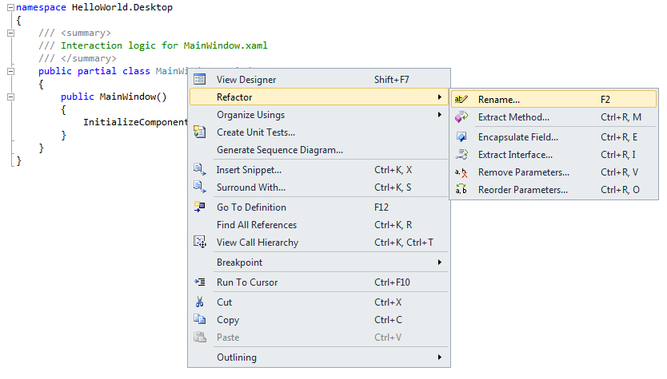
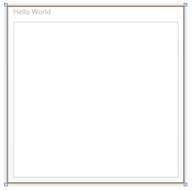
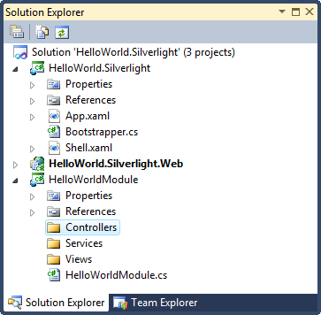

# 17: Getting Started Using the Prism Library 5.0 for WPF Hands-on Lab

From: [Developer's Guide to Microsoft Prism Library 5.0 for WPF](/patterns-practices/guide/developers-guide-to-microsoft-prism)

In this lab and associated sample, you will learn the basic concepts of modular application development using the Prism Library, and apply them to create a solution that you can use as the starting point for building a composite Windows Presentation Foundation (WPF) application. After completing this lab, you will be able to do the following:

-  You will create a new solution based on the Prism Library.
-  You will create and load a module.
-  You will create a view and show it in the shell window.

## System Requirements

This guidance was designed to run on the Microsoft Windows 8, Windows 7, Windows Vista, Windows Server 2012, or Windows Server 2008 operating system. WPF applications built using this guidance require the .NET Framework 4.5.

Before you can use the Prism Library, the following must be installed:

-  Microsoft Visual Studio 2013 Professional, Premium, or Ultimate editions
-  Microsoft .NET Framework 4.5 (installed with Visual Studio 2013)
-  Optional tool:
  -  [Microsoft Blend for Visual Studio 2013](http://www.microsoft.com/expression/products/blend_overview)

## Preparation

This topic requires you to have the following Prism Library and Unity Application Block (Unity) assemblies which can be downloaded from NuGet:

-  [Prism](http://aka.ms/prism-wpf-prism50nuget)
-  [Prism.UnityExtensions](http://aka.ms/prism-wpf-prism50unityextensionsnuget)

> [!NOTE]
> This hands-on lab uses the Unity container, but you can also use the Managed Extensibility Framework (MEF) with the Prism Library.

This hands-on lab assumes that you understand Prism basic concepts. For more information, see [Prism Key Concepts](/patterns-practices/guide/1-introduction-to-the-prism-library-5.0-for-wpf(v=pandp.40)#PrismKeyConcepts) in the [Introduction](/patterns-practices/guide/1-introduction-to-the-prism-library-5.0-for-wpf(v=pandp.40)).

## Procedures

This lab includes the following tasks:

-  Task 1: Creating a Solution Using the Prism Library
-  Task 2: Adding a Module
-  Task 3: Adding a View

The next sections describe each of these tasks.

> [!NOTE]
> The instructions for this hands-on lab are based on the HelloWorld solution. To open the solution in Visual Studio, run the file Desktop only - Open QS - Hello World QuickStart.lnk.

## Task 1: Creating a Solution Using the Prism Library

In this task, you will create a solution using the Prism Library. You will be able to use this solution as a starting point for your composite WPF application. The solution includes recommended practices and techniques and is the basis for the procedures in Prism. To create a solution with the Prism Library, the following tasks must be performed:

1. **Create a solution with a shell project**. In this task, you create the initial Visual Studio solution and add a WPF Application project that is the basis of solutions built using Prism Library. This project is known as the shell project.
2. **Set up the shell window**. In this task, you set up a window, the shell window, to host different user interface (UI) components in a decoupled way.
3. **Set up the application's bootstrapper**. In this task, you set up code that initializes the application.

The following procedure describes how to create a solution with a shell project. A shell project is the basis of a typical application built using the Prism Library—it is a WPF Application project that contains the application's startup code, known as the bootstrapper, and a main window where views are typically displayed (the shell window).

**To create a solution with a shell project**

1. In Visual Studio, create a new WPF application. To do this, point to **New** on the **File** menu, and then click **Project**. In the **Project types** list, select **Windows** inside the **Visual C#** node. In the **Templates** box, click **WPF Application**. Finally, set the project's name to **HelloWorld.Desktop**, specify a valid location, and then click **OK**.

  Visual Studio will create the HelloWorld project, as shown in the following illustration. This project will be the shell project of your application.

  

  HelloWorld project

2. In the HelloWorld Project, add references to the following NuGet packages:
  -  **Prism.** In the NuGet Package Manager search for Prism. This package contains the implementation of the Prism Library composition components such as modularity, logging services, communication services, and definitions for several core interfaces. It also contains the implementation of Prism Library components that target WPF applications, including regions, events, and MVVM.
  -  **Prism.UnityExtensions.** In the NuGet Package Manager search for Prism.UnityExtensions**.** This package includes the Microsoft.Practices.UnityExtensions assembly which contains utility classes you can reuse in applications built with the Prism Library that consume the [Unity Application Block](http://www.msdn.com/unity). For example, it contains a bootstrapper base class, the **UnityBootstrapper** class, that creates and configures a Unity container with default Prism Library services when the application starts.

The shell window is the top-level window of an application based on the Prism Library. This window is a place to host different UI components that exposes a way for itself to be dynamically populated by others, and it may also contain common UI elements, such as menus and toolbars. The shell window sets the overall appearance of the application.

The following procedure explains how to set up the shell window.

**To set up the shell window**

1. In Solution Explorer, rename the file MainWindow.xaml to Shell.xaml.
2. Open the code-behind file Shell.xaml.cs and rename the **MainWindow** class to **Shell** using the Visual Studio refactoring tools. To do this, right-click **MainWindow** in the class signature, point to **Refactor**, and then click **Rename**, as shown in the following illustration. In the **Rename** dialog box, type **Shell** as the new name, and then click **OK**. If the **Preview Changes – Rename** dialog box appears, click **Apply**.

  

  MainWindow renaming using Visual Studio refactoring tools

3. In XAML view, open the Shell.xaml file, and then set the following attribute values to the **Window** root element:

  -  x:Class = "HelloWorld.Desktop.Shell" (this matches the code behind class's name)
  -  Title = "Hello World"

  Your code should look like the following.

  ```XAML
    <Window x:Class="HelloWorld.Desktop.Shell"
        xmlns="http://schemas.microsoft.com/winfx/2006/xaml/presentation"
        xmlns:x="http://schemas.microsoft.com/winfx/2006/xaml"
        Title="Hello World" Height="300" Width="300">
      <Grid>
        
      </Grid>
    </Window>
``` 

## Regions

The following procedure describes how to add an **ItemsControl** control to the shell window and associate a region to it. In a subsequent task, you will dynamically add a view to this region.

**To add a region to the shell window**

1. In the Shell.xaml file, add the following namespace definition to the root **Window** element. You need this namespace to use an attached property for regions that is defined in the Prism Library.
```XAML
    xmlns:prism="http://www.codeplex.com/prism"
```
	
2. Replace the **Grid** control in the shell window with an **ItemsControl** control named **MainRegion**, as shown in the following code.
```XAML
    <Window x:Class="HelloWorld.Desktop.Shell"
      xmlns:prism="http://www.codeplex.com/prism"
      xmlns="http://schemas.microsoft.com/winfx/2006/xaml/presentation"
      xmlns:x="http://schemas.microsoft.com/winfx/2006/xaml"
      Title="Hello World" Height="300" Width="300">
      
      <ItemsControl Name="MainRegion"/>

    </Window>
```
  The following illustration shows the shell window in the Design view.

  

  Shell window with an ItemsControl control

3. In the **ItemsControl** control definition, set the attached property **prism:RegionManager.RegionName** to "MainRegion", as shown in the following code. This attached property indicates that a region named MainRegion is associated to the control.
```XAML
    <ItemsControl Name="MainRegion" prism:RegionManager.RegionName="MainRegion"/>
```

> [!NOTE]
> When the shell window is instantiated, WPF resolves the value of the **prism:RegionManager.RegionName** attached property and invokes a callback in the **RegionManager** class. This callback creates a region and associates it with the **ItemsControl** control.

## Bootstrapper

The bootstrapper is responsible for the initialization of an application built using the Prism Library. The Prism Library includes **UnityBootstrapper** and **MefBootstrapper** classes, which implement most of the functionality necessary to use either Unity or MEF as the container in your application. If you are using a container other than Unity or MEF, you should write your own container-specific bootstrapper.

The following procedure explains how to set up the application's bootstrapper.

**To set up the application's bootstrapper**

1. Add a new class file named Bootstrapper.cs to the HelloWorld project.
2. Add the following **using** statements at the top of the file. You will use them to refer to elements referenced in the **UnityBootstrapper** class.
```C#
    using System.Windows;
    using Microsoft.Practices.Prism.Modularity;
    using Microsoft.Practices.Prism.UnityExtensions;
    using Microsoft.Practices.Unity;
```

3. Update the **Bootstrapper** class's signature to inherit from the **UnityBootstrapper** class.
```C#
    class Bootstrapper : UnityBootstrapper
    {
    }
```

4. Override the **CreateShell** method in the **Bootstrapper** class. In this method, create an instance of the shell window and return it, as shown in the following code.
```C#
    protected override DependencyObject CreateShell()
    {
      return new Shell();
    }
```

  > [!NOTE]
> You return the shell object to have the **UnityBootstrapper** base class attach an instance of the region manager service to it. The region manager service is a service included in the Prism Library that manages regions in the application. By having a region manager instance attached to the shell window, you can declaratively register regions from XAML code that will exist in the scope of the shell window and child views.

5. Override the **InitializeShell** method in the **Bootstrapper** class. In this method, display the shell to the user.
```C#
    protected override void InitializeShell()
    {
      base.InitializeShell();

      Application.Current.MainWindow = (Window)this.Shell;
      Application.Current.MainWindow.Show();
    }
```

6. Override the **ConfigureModuleCatalog** method. In this template method, you populate the module catalog with modules. The module catalog interface is **Microsoft.Practices.Prism.Modularity.IModuleCatalog**, and it contains metadata for all the modules in the application. Because the application contains no modules at this point, the implementation of the **ConfigureModuleCatalog** method should simply call the base implementation and return. You can paste the following code in your **Bootstrapper** class to implement the method.
```C#
    protected override void ConfigureModuleCatalog()
    {
      base.ConfigureModuleCatalog();
    }
```

7. More details about module loading and module catalogs are described [Task 2: Adding a Module](#task2addingmodule) later in this topic.

8. Open the file App.xaml.cs and initialize the Bootstrapper in the handler for the **Startup** event of the application, as shown in the following code. By doing this, the bootstrapper code will we executed when the application starts.
```C#
    public partial class App : Application
    {  protected override void OnStartup(StartupEventArgs e)
      {
        base.OnStartup(e);
        Bootstrapper bootstrapper = new Bootstrapper();
        bootstrapper.Run();
      }
    }
```

9. Open the App.xaml file and remove the attribute **StartupUri**. Because you are manually instantiating the shell window in your bootstrapper, this attribute is not required. The code in the App.xaml file should look like the following.
```C#
    <Application x:Class="HelloWorld.Desktop.App"
      xmlns="http://schemas.microsoft.com/winfx/2006/xaml/presentation"
      xmlns:x="http://schemas.microsoft.com/winfx/2006/xaml">
      <Application.Resources>
         
      </Application.Resources>
    </Application>
```

10. Build and run the application. You should see an empty Hello World window, as shown in the following illustration.

  

  Hello World window


## Task 2: Adding a Module


In this task, you will create a module and add it to your solution. A module in Prism is a logical unit in your application. Adding a module to your solution involves the following tasks:

1. **Creating a module**. In this task, you create a module project with a module class.
2. **Configuring how the module is loaded**. In this task, you configure your application to load the module.

The following procedure describes how to create a module.

**To create a module**

1. Add a new class library project to your solution. To do this, right-click the **HelloWorld.Desktop** solution node in Solution Explorer, point to **Add**, and then click **New Project**. In the **Project types** list, select **Windows** in the **Visual C#** node. In the **Templates** box, click **Class Library**. Finally, set the project's name to HelloWorldModule, and then click **OK**. The following illustration shows your solution.

  

  Solution with a module named HelloWorldModule

2. Add references in your module to the following WPF assemblies. To do this, right-click the **HelloWorldModule** project in Solution Explorer, and then click **Add Reference**. In the **Add Reference** dialog box, select the Assemblies tab, then select the following assemblies, and then click **OK**:
  -  **PresentationCore.dll**
  -  **PresentationFramework.dll**
  -  **WindowsBase.dll**
  -  **System.Xaml.dll**
3. Add references in your module to the following Prism Library assemblies. To do this, right-click the **HelloWorld.Desktop** solution in Solution Explorer, and then click **Manage NuGet Packages for Solution**. Click the **Installed Packages** button, select the following assemblies, and then click **Manage**:

  -  **Prism**

  In the **Selected Projects** dialog, select HelloWorldModule, and then click **OK**. Finally, close the Manage NuGet Packages window by clicking **Close**.

4. Rename the Class1.cs file to HelloWorldModule.cs. To do this, right-click the file in Solution Explorer, click **Rename**, type the new name, and then press ENTER. In the dialog box that asks if you want to perform a rename of all references to your class, click **Yes**.
5. Open the file HelloWorldModule.cs and add the following **using** statement at the top of the file. You will use it to refer to modularity elements provided by the Prism Library.
```C#
    using Microsoft.Practices.Prism.Modularity;
```

6. Change the class signature to implement the **IModule** interface, as shown in the following code.
```C#
    public class HelloWorldModule : IModule
    {
    }
```

7. In the **HelloWorldModule** class, add an empty definition of the **Initialize** method, as shown in the following code.
```C#
    public void Initialize()
    {
    }
```

8. Add a Views folder to the HelloWorldModule project. In this folder, you will store your view implementations. To do this, right-click the **HelloWorldModule** project in Solution Explorer, point to **Add**, and then click **New Folder**. Change the folder name to Views.

  This step is recommended to organize your projects; this is useful when a module contains several artifacts. The following are other common folders that you can add to your module:

  -  **Services**. In this folder, you store service implementations and service interfaces.
  -  **ViewModels**. In this folder, you store view models.

  The following illustration shows the solution with the **HelloWorldModule** module.

  

  Solution with the HelloWorldModule

9. Build the solution.

At this point, you have a solution based on the Prism Library with a module. However, the module is not being loaded into the application. The following section describes module loading and how you can load modules with the Prism Library.

## Module in the Application Life Cycle

Modules go through a three-step process during application startup:

1. Modules are discovered by the module catalog. The module catalog contains a collection of metadata about those modules. This metadata can be consumed by the module manager service.
2. The module manager service coordinates the modules initialization. It manages the retrieval and the subsequent initialization of the modules. It loads modules—retrieving them if necessary—and validates them.
3. Finally, the module manager instantiates the module and calls the module's **Initialize** method.

### Populating the Module Catalog

The Prism Library provides several ways to populate the module catalog. In WPF, you can populate the module catalog from code, from a XAML file, from a configuration file, or from a directory. The following procedure explains how to populate the catalog from code to load the HelloWorldModule module into the HelloWorld.Desktop application.

**To populate the module catalog with the HelloWorld module from code**

1. In your shell project, add a reference to the module project. To do this in Solution Explorer, right-click the **HelloWorld.Desktop** project, and then click **Add Reference**. In the **Reference Manager** dialog box, click the **Solution** tab, select the **HelloWorldModule** project, and then click **OK**.
2. Open the Bootstrapper.cs file and explore the **ConfigureModuleCatalog** method. The method implementation is shown in the following code.
```C#
    protected override void ConfigureModuleCatalog()
    {
      base.ConfigureModuleCatalog();
    }
```

  The **ModuleCatalog** class is used to define the application's modules from code—it implements the methods included in the **IModuleCatalog** interface and adds an **AddModule** method for developers to manually register modules that should be loaded in the application. The signature of this method is shown in the following code.

    public ModuleCatalog AddModule(Type moduleType, InitializationMode initializationMode, params string[] dependsOn)

  The **AddModule** method returns the same module catalog instance and takes the following parameters:

  -  **The module initializer class's type of module to load**. This type must implement the **IModule** interface.
  -  **The Initialization mode**. This parameter indicates how the module will be initialized. The possible values are **InitializationMode.WhenAvailable** and **InitializationMode.OnDemand**.
  -  **An array containing the names of the modules that the module depends on, if any**. These modules will be loaded before your module to ensure your module dependencies are available when it is loaded.

3. Update the **ConfigureModuleCatalog** method to register the HelloWorldModule module with the module catalog instance. To do this, you can replace the **ConfigureModuleCatalog** implementation with the following code.
```C#
    protected override void ConfigureModuleCatalog()
    {
      base.ConfigureModuleCatalog();
      ModuleCatalog moduleCatalog = (ModuleCatalog)this.ModuleCatalog;
      moduleCatalog.AddModule(typeof(HelloWorldModule.HelloWorldModule));
    }
```

4. > [!NOTE]
> In this example, the modules are directly referenced by the shell. That is why this example is able to use **typeof(Module)** to add modules to the catalog. But keep in mind that modules whose type is not already available can also be added to the catalog.<br />The **WhenAvailable** initialization mode is the default value if no initialization mode is specified.

5. Build and run the solution. To verify that the HelloWorldModule module gets initialized, add a breakpoint to the **Initialize** method of the **HelloWorldModule** class. The breakpoint should be hit when the application starts.

## Task 3: Adding a View

In this task, you will create and add a view to the **HelloWorldModule** module. Views are objects that contain visual content. Views are often user controls, but they do not have to be user controls. Adding a view to your module involves the following tasks:

1. **Creating the view**. In this task, you implement the view by creating the visual content and writing code to manage the UI elements in the view.
2. **Showing the view in a region**. In this task, you obtain a reference to a region and add the view to it.

The following procedure describes how to create a view.

**To create a view**

1. Add a new WPF user control to your module. To do this, right-click the Views folder in Solution Explorer, point to **Add**, and then click **New Item**. In the **Add New Item** dialog box, select the User Control (WPF) template, set the name to **HelloWorldView.xaml**, and then click **Add**.
2. Add a "Hello World" text block to the view. To do this, you can replace your code in the file HelloWorldView.xaml with the following code.

    ```XAML
        <UserControl x:Class="HelloWorldModule.Views.HelloWorldView"
        xmlns="http://schemas.microsoft.com/winfx/2006/xaml/presentation"
        xmlns:x="http://schemas.microsoft.com/winfx/2006/xaml">
        <Grid>
            <TextBlock Text="Hello World" Foreground="Green" HorizontalAlignment="Center" VerticalAlignment="Center" FontFamily="Calibri" FontSize="24" FontWeight="Bold"></TextBlock>
        </Grid>
        </UserControl>
    ```

3. Save the file.

> [!NOTE]
> To keep this hands-on lab simple, the procedure did not explain how to create a view following the Model-View-ViewModel (MVVM) pattern. For more information about the MVVM pattern, see [Implementing the MVVM Pattern](/patterns-practices/guide/5-implementing-the-mvvm-pattern-using-the-prism-library-5.0-for-wpf).

## Region Manager

The region manager service****is responsible for maintaining a collection of regions and creating new regions for controls. This service implements the **Microsoft.Practices.Prism.Regions.IRegionManager** interface. Typically, you interact directly with this service to locate regions in a decoupled way through their name and add views those regions. By default, the **UnityBootstrapper** base class registers an instance of this service in the application container. This means that you can obtain a reference to the region manager service in the HelloWorld application by using dependency injection.

The following procedure explains how to obtain an instance of the region manager and add the HelloWorldView view to the shell's main region.

**To show the view in the shell**

1. Open the HelloWorldModule.cs file.
2. Add the following **using** statement to the top of the file. You will use it to refer to the region elements in the Prism Library.
```C#
    using Microsoft.Practices.Prism.Regions;
```

3. Create a private read-only instance variable to hold a reference to the region manager. To do this, paste the following code inside the class body.
```C#
    private readonly IRegionManager regionManager;
```

4. Add the constructor of the **HelloWorldModule** class to obtain a region manager instance through constructor dependency injection and store it in the **regionManager** instance variable. To do this, the constructor has to take a parameter of type **Microsoft.Practices.Prism.Regions.IRegionManager**. You can paste the following code inside the class body to implement the constructor.
```C#
    public HelloWorldModule(IRegionManager regionManager)
    {
     this.regionManager = regionManager;
    }
```

5. In the **Initialize** method, invoke the **RegisterViewWithRegion** method on the **RegionManager** instance. This method registers a region name with its associated view type in the region view registry; the registry is responsible for registering and retrieving of these mappings.

  The **RegisterViewWithRegion** method has two overloads. When you want to register a view directly, you use the first overload that requires two parameters, the region name and the type of the view. This is shown in the following code.
```C#
    public void Initialize()
    {  regionManager.RegisterViewWithRegion("MainRegion", typeof(Views.HelloWorldView));
    }
```

  The UI composition approach used in the preceding code is known as view discovery. When using this approach, you specify the views and the region where the views will be loaded. When a region is created, it asks for its associated views and automatically loads them.

  > [!NOTE]
> The region's name must match the name defined in the **RegionName** attribute of the region.

6. Build and run the application. You should see the Hello World window with a "Hello World" message, as shown in the following illustration.

  

  Hello World message

> [!NOTE]
> To open the solution that results from performing the steps in this Hands-on Lab in Visual Studio, run the file Desktop only - Open QS - Hello World QuickStart.lnk.

## More Information

To learn about code samples included with Prism, see the following topics:

-  [Stock Trader Reference Implementation](/patterns-practices/guide/stock-trader-reference-implementation-using-the-prism-library-5.0-for-wpf)
-  [Modularity QuickStarts](/patterns-practices/guide/modularity-quickstarts-using-the-prism-library-5.0-for-wpf)
-  [Interactivity QuickStart](/patterns-practices/guide/interactivity-quickstart-using-the-prism-library-5.0-for-wpf)
-  [MVVM QuickStart](/patterns-practices/guide/mvvm-quickstart-using-the-prism-library-5.0-for-wpf)
-  [Commanding QuickStart](/patterns-practices/guide/commanding-quickstart-using-the-prism-library-5.0-for-wpf)
-  [UI Composition QuickStart](/patterns-practices/guide/ui-composition-quickstart-using-the-prism-library-5.0-for-wpf)
-  [State-Based Navigation QuickStart](/patterns-practices/guide/state-based-navigation-quickstart-using-the-prism-library-5.0-for-wpf)
-  [View-Switching Navigation QuickStart](/patterns-practices/guide/view-switching-navigation-quickstart-using-the-prism-library-5.0-for-wpf)
-  [Event Aggregation QuickStart](/patterns-practices/guide/event-aggregation-quickstart-using-the-prism-library-5.0-for-wpf)

