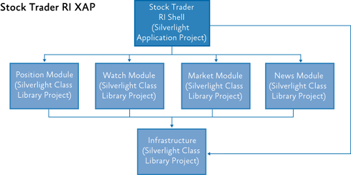
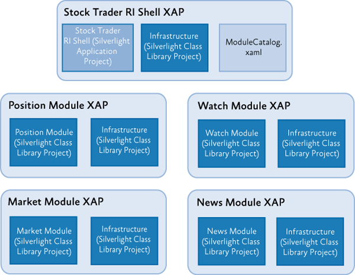
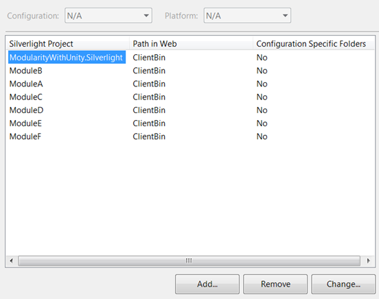

# Deploying Prism Silverlight Applications

From: [Prism 4.1 - Developer's Guide to Microsoft Prism Library for WPF and Silverlight](/patterns-practices/guide/index)

To successfully move a Prism application into production, you need to plan for deployment as part of the design process of your application. This topic covers the considerations and actions you need to perform to prepare your Silverlight application for deployment and the actions you need to take to get the application in the user's hands.

## Deploying Silverlight Prism Applications

Silverlight applications are delivered as XAP files via an HTTP request from a browser. A XAP file is really just a .zip file with a different file name extension and certain expectations about its content. A XAP file contains a set of application assemblies, an application manifest XAML file that describes the package, and possibly additional resource files that the application uses. The XAP file is downloaded by the Silverlight plug-in hosted in a web page. After the Silverlight plug-in is downloaded, it activates the application and runs it within the context of a web page.

Even if you plan to run your Silverlight application Out-Of-Browser (OOB), the user will first need to access the application with the browser via its hosting page; after that, the user can then optionally install the application for OOB use. As a result, the deployment of a Silverlight Prism application is mostly a matter of getting your XAP files in the right place on a web server so the hosting page can download and run them.

## Packaging Prism Modules as XAP Files

As discussed in "[Modular Application Development](/patterns-practices/guide/4-modular-application-development-using-prism-library-5.0-for-wpf)," you can package your modules in multiple ways, including having multiple modules in a single XAP file or having a single XAP file act as a container for a single module. The decision should be determined by whether multiple modules need to be downloaded at the same time because of dependencies between them or the use cases of the application, or whether the modules are logically independent and decoupled in lifetime. Packaging each module in its own XAP file can be a little cleaner from a maintenance and deployment perspective, because each module XAP file becomes a separate unit of deployment that can be versioned independently and added or removed from the application through a simple change to the module catalog.

As an example, consider the architecture of the Stock Trader Reference Implementation (Stock Trader RI). It consists of the shell application and four modules: position, watch, market, and news. Because the application was designed for all those features to "light up" at application start, the modules of the Stock Trader RI are all added statically. The Stock Trader RI shell application project has references to all the module assemblies as class libraries, and the modules are loaded through the **ModuleCatalog.AddModule** method during application startup in the bootstrapper. In this case, there is only a single XAP that results from the building of the StockTraderRI.Silverlight shell application project, and it contains the shell, the four modules, and the shared infrastructure class library, as shown in the following illustration. If you were deploying the StockTraderRI application, you would simply place that XAP file on your web server and set up the source parameter tag of your Silverlight plug-in object tag in the hosting page to point to that XAP file (typically in a \\ClientBin subfolder of your site, using an ASP.NET Web Application hosting project template).



Stock Trader RI XAP structure

Alternatively, if the modules of the Stock Trader RI were more loosely coupled in terms of when they needed to be loaded, they could have been developed as Silverlight Application projects so they would be built into individual XAP files. If you did that, the deployment architecture would look more like the following illustration. After you break the modules into their own XAP files, you can choose to delay the loading of some of the modules, if appropriate, based on the application functionality. You would typically use a ModuleCatalog.xaml file packaged as part of the shell XAP file to determine what modules the application is composed of, what their dependencies are, and what their loading characteristics are (on-demand or not).

Notice in the following illustration that because the shell and each of the modules has a reference to the infrastructure assembly as a shared class library, if you leave the default settings on those references, you will end up with a separate copy of the library in each of the individual XAP files, which adds unnecessary download size and bandwidth utilization to the application.

> [!NOTE]
> If you plan to have your users install the application OOB, and you expect to deploy updates to your application after it is deployed, you will need to stick to putting all the modules in a single XAP file. The <strong>Application.CheckAndDownloadUpdateAsync</strong> method will only go out and update the main XAP file that the application was launched from.



Modified Stock Trader RI XAP structure

## Reducing the Download Size of Your Module XAP Files

To address the duplication of shared class libraries in multiple module XAP files in a Prism application, you have a couple of options. The first is to include the shared library in the shell application XAP file, as it will be by default when you add the reference. Then you go to the reference in each of the modules that also uses the reference and set the **Copy Local** property on the reference to **false**. This causes the referenced assembly to not be included in the compiled XAP file for that module. However, at run time, the one provided by the shell application XAP file will also be available to the modules.

The second approach is to leverage application library caching in Silverlight. To use this feature, you go to the Silverlight project properties of a project and select the check box labeled **Reduce XAP size by using application library caching**. When you do this, any referenced assemblies that have the right metadata files collocated with them will not be included in the XAP file; instead, they will be placed in a separate .zip file, and the .zip file will be referenced by the XAP file's ApplicationManifest.xaml file as an external part. The signed Silverlight Prism Library binaries have the required metadata files to use this feature as well as the libraries from the Silverlight SDK and the Silverlight Toolkit. To leverage this functionality for your own shared assemblies, you need to provide a metadata file, as described in the topic, [How to: Use Application Library Caching](http://msdn.microsoft.com/en-us/library/dd833069(vs.95).aspx) on MSDN.

## Preparing Your Web Server to Host Silverlight Applications

Silverlight applications can be hosted on most types of web servers, such as Internet Information Services (IIS) or Apache. However, most web servers are usually configured to serve only a few well-known file name extensions. To allow Silverlight applications to be served from your web server, you have to allow the MIME types in the following table to be served.

<table>
<colgroup>
<col width="50%" />
<col width="50%" />
</colgroup>
<thead>
<tr class="header">
<th><p>Extension</p></th>
<th><p>MIME type</p></th>
</tr>
</thead>
<tbody>
<tr class="odd">
<td><p>.xaml</p></td>
<td><p>application/xaml+xml</p></td>
</tr>
<tr class="even">
<td><p>.xap</p></td>
<td><p>application/x-silverlight-app</p></td>
</tr>
</tbody>
</table>

## Deploying the Application

To deploy a Silverlight application and the modules that are remotely loaded, the XAP files must be made accessible on the web server. There are several ways to accomplish this:

- You can manually copy all the XAP files to a public folder on the web server.
- You can include the Silverlight XAP files in a web project or website and publish from Microsoft Visual Studio. To do this with a Web Application project, the project needs to be part of the same solution as the Silverlight projects that create the XAP files. You then add the Silverlight projects to the **Silverlight Applications** tab in the web project settings, as shown in the following illustration. A copy of the XAP files from the included Silverlight projects will be placed in a \\ClientBin subfolder of the published site. These files are synchronized in the web project each time you build.

  

  Adding the remote modules as Silverlight applications

  > [!NOTE]
  > To avoid cross-domain call issues, the remote modules' XAP files should be located on the same domain as the main application; when deployed like this, the <strong>Ref</strong> property on the ModuleCatalog should be a Uniform Resource Identifier (URI) relative to the main XAP file location on the web server.

In addition to publishing or locating the XAP files in the hosting website, the hosting web page will need to refer to the shell application XAP file in its object tag source parameter. Because the hosting page should be part of the same site that the XAP files are placed in for cross-domain reasons, the path specified in the host page should be a relative path.

```XAML
    <object data="data:application/x-silverlight-2," type="application/x-silverlight-2" width="100%" height="100%">
        <param name="source" value="ClientBin/ModularityWithUnity.Silverlight.xap"/>
             ...
    </object>
```

## More Information

To learn how to use application library caching in Silverlight, see [How to: Use Application Library Caching](http://msdn.microsoft.com/en-us/library/dd833069(vs.95).aspx) on MSDN.

To download the Manifest Manager Utility from the Prism community site on Codeplex at <http://compositewpf.codeplex.com/releases/view/14771>.

