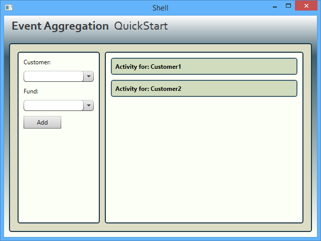
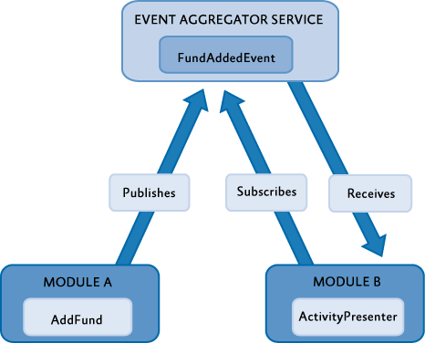

# Event Aggregation QuickStart Using the Prism Library 5.0 for WPF

From: [Developer's Guide to Microsoft Prism Library 5.0 for WPF](/patterns-practices/index)

The Event Aggregation QuickStart sample demonstrates how to build a composite application that uses the Prism Library’s Event Aggregator service. This service enables you to establish loosely coupled communications between components in your application. The Event Aggregator is a Portable Class Library (PCL) so it can be used on WPF, Windows Phone 8, and Windows Store apps.

## Business Scenario

The main window of the Event Aggregation QuickStart represents a subset of a fictitious financial system. In this window, users can add funds to customers and see the activity log for each customer. The following illustration shows the QuickStart main window.



Event Aggregation QuickStart user interface

## Building and Running the QuickStart

This QuickStart requires Visual Studio 2012 or later and the .NET Framework 4.5.1 to run.

**To build and run the Event Aggregation QuickStart**

1. In Visual Studio, open the solution file Quickstarts\\EventAggregation\\EventAggregation\_Desktop.sln.
2. On the **Build** menu, click **Rebuild Solution**.
3. Press **F5** to run the **QuickStart.**

## Implementation Details

The QuickStart highlights the key elements that interact when using the Event Aggregator service. This section describes the key artifacts of the QuickStart, which are shown in the following illustration.



Event Aggregation QuickStart conceptual view

## The FundAddedEvent Event

The **FundAddedEvent** event is raised when the user adds a fund for a customer. This event is used by the modules ModuleA and ModuleB to communicate in a loosely coupled way. The following code shows the event class signature; the class extends the **PubSubEvent&lt;TPayload&gt;** class, specifying **FundOrder** as the payload type. This code is located at EventAggregation.Infrastructure.Dektop\\FundAddedEvent.cs.

```C#
  public class FundAddedEvent : PubSubEvent<FundOrder>
  {
  }
```

The following code is the class definition for the **FundOrder** class; this class represents a fund order and specifies the ticker symbol and the customer's identifier. This code is located at EventAggregation.Infrastructure.Desktop\\FundOrder.cs.

```C#
  public class FundOrder
  {
    public string CustomerId { get; set; }
    public string TickerSymbol { get; set; }
  }
```

## Event Publishing

When the user adds a fund for a customer, the event **FundAddedEvent** is published by the **AddFundPresenter** class (located at ModuleA.Desktop\\AddFundPresenter.cs). The following code shows how the **FundAddedEvent** is published.
```C#
  void AddFund(object sender, EventArgs e)
  {
    FundOrder fundOrder = new FundOrder();
    fundOrder.CustomerId = View.Customer;
    fundOrder.TickerSymbol = View.Fund;

    if (!string.IsNullOrEmpty(fundOrder.CustomerID) && !string.IsNullOrEmpty(fundOrder.TickerSymbol))
      eventAggregator.GetEvent<FundAddedEvent>().Publish(fundOrder);
  }
```

In the preceding code, first a **FundOrder** instance is created and set up. Then, the **FundAddedEvent** is retrieved from the Event Aggregator service and the **Publish** method is invoked on it; this supplies the recently created **FundOrder** instance as the **FundAddedEvent** event's parameter.

## Event Subscription

The ModuleB module contains a view named **ActivityView**. An instance of this view shows the activity log for a single customer. The ModuleB initializer class creates two instances of this view, one for Customer1 and one for Customer2, as shown in the following code (this code is located at ModuleB.Desktop\\ModuleB.cs).

```C#
  public void Initialize()
  {
    ActivityView activityView1 = Container.Resolve<ActivityView>();
    ActivityView activityView2 = Container.Resolve<ActivityView>();

    activityView1.CustomerId = "Customer1";
    activityView2.CustomerId = "Customer2";

    IRegion rightRegion = RegionManager.Regions["RightRegion"];
    rightRegion.Add(activityView1);
    rightRegion.Add(activityView2);
  }
```

When an instance of the **ActivityView** view is created, its presenter subscribes an event handler to the **FundAddedEvent** event using a filter expression. This filter expression defines a condition that the event's argument must meet for the event handler to be invoked. In this case, the condition is satisfied if the fund order corresponds to the customer associated to the view. The event handler contains code to display the new fund added to the customer in the user interface.

The following code shows the **CustomerId** property of the **ActivityPresenter** class. In the property setter, an event handler for the **FundAddedEvent** event is subscribed using the Event Aggregator service.
```C#
  public string CustomerId
  {
    get { return _customerId; }
    set
    {
      _customerId = value;

      FundAddedEvent fundAddedEvent = eventAggregator.GetEvent<FundAddedEvent>();

      if (subscriptionToken != null)
      {
        fundAddedEvent.Unsubscribe(subscriptionToken);
      }

      subscriptionToken = fundAddedEvent.Subscribe(FundAddedEventHandler, ThreadOption.UIThread, false, FundOrderFilter);

      View.Title = string.Format(CultureInfo.CurrentCulture, Resources.ActivityTitle, CustomerId);
    }
  }
```

The following line, extracted from the preceding code, shows how the event handler is subscribed to the **FundAddedEvent** event.

```C#
  subscriptionToken = fundAddedEvent.Subscribe(FundAddedEventHandler, ThreadOption.UIThread, false, FundOrderFilter);
```

In the preceding line, the following parameters are passed to configure the subscription:

- The **FundAddedEventHandler** action<strong>.</strong> This event handler is executed when the **Add** button is clicked and the filter condition is satisfied.
- The **ThreadOption.UIThread** option<strong>.</strong> This option specifies that the event handler will run on the user interface thread.
- The **KeepSubscriberReferenceAlive** flag. This flag is **false** and indicates that the lifetime of the subscriber's reference is not managed by the event. This is set to **false** because the lifetime of the subscriber, the presenter class, is managed by its view, which contains a reference to it.
- The **filter** predicate. This filter is a condition that specifies that the event handler is invoked only when the fund is added to the view's corresponding customer.

## Unit and Acceptance Tests

The Event Aggregator QuickStart includes unit tests within the solution. Unit tests verify if individual units of source code work as expected.

## Unit Tests

**To run the Event Aggregator QuickStart unit tests**

-  On the **Test** menu of Visual Studio, point to **Run**, and then click **All Tests**.

### Outcome

You should see the Test Results pane in Visual Studio indicating that all the unit tests passed.

## Acceptance Tests

The Event Aggregator QuickStart includes a separate solution that includes acceptance tests. The acceptance tests describe how the application should perform when you follow a series of steps; you can use the acceptance tests to explore the functional behavior of the application in a variety of scenarios.

**To run the Event Aggregator QuickStart acceptance tests**

1. In Visual Studio, open the solution file QuickStarts\\EventAggregation\\EventAggregation.Tests.AcceptanceTest\\EventAggregation.Tests.AcceptanceTest.sln.
2. Open **Test Explorer**.
3. After building the solution, Visual Studio finds the tests. Click the **Run All** button to run the acceptance tests.

### Outcome

You should see the QuickStart window and the tests automatically interact with the application. At the end of the test run, you should see that all tests have passed.

## More Information

For more information about event aggregation, see [Communicating Between Loosely Coupled Components](/patterns-practices/guide/9-communicating-between-loosely-coupled-components-using-the-prism-library-5.0-for-wpf).

To learn about other code samples included with Prism, see the following topics:

-  [Stock Trader Reference Implementation](/patterns-practices/guide/stock-trader-reference-implementation-using-the-prism-library-5.0-for-wpf)
-  [Modularity QuickStarts](/patterns-practices/guide/modularity-quickstarts-using-the-prism-library-5.0-for-wpf)
-  [Interactivity QuickStart](/patterns-practices/guide/interactivity-quickstart-using-the-prism-library-5.0-for-wpf)
-  [MVVM QuickStart](/patterns-practices/guide/mvvm-quickstart-using-the-prism-library-5.0-for-wpf)
-  [Commanding QuickStart](/patterns-practices/guide/commanding-quickstart-using-the-prism-library-5.0-for-wpf)
-  [UI Composition QuickStart](/patterns-practices/guide/ui-composition-quickstart-using-the-prism-library-5.0-for-wpf)
-  [State-Based Navigation QuickStart](/patterns-practices/guide/state-based-navigation-quickstart-using-the-prism-library-5.0-for-wpf)
-  [View-Switching Navigation QuickStart](/patterns-practices/guide/view-switching-navigation-quickstart-using-the-prism-library-5.0-for-wpf)

