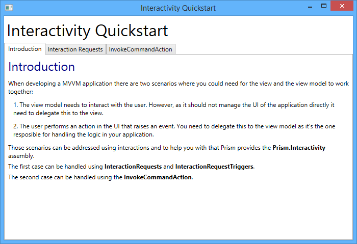
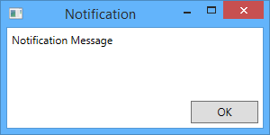
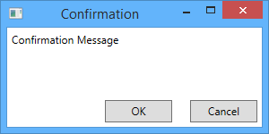
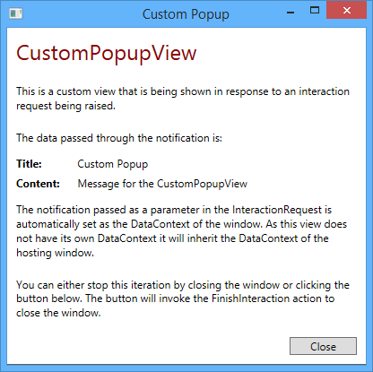

# Interactivity QuickStart Using the Prism Library 5.0 for WPF

From: [Developer's Guide to Microsoft Prism Library 5.0 for WPF](/guide/developers-guide-to-microsoft-prism.aspx)

The Interactivity QuickStart demonstrates how views and view models can interact with the user. This includes interactions triggered from the view model and interactions fired by controls located in the view. To handle these different interactions the Prism library provides **InteractionRequests** and **InteractionRequestTriggers**, along with the custom **InvokeCommandAction** action. InvokeCommandAction is used to connect a trigger including events to a WPF command.

## Scenarios

This section describes the scenarios included in the interactivity QuickStart. The QuickStart is composed of three tabs: Introduction, Interaction Requests, and InvokeCommandAction.

The **Introduction** tab, contains information about the purposes of the QuickStart. The **Interaction Requests** tab, which includes four different scenarios, describes the usage of **InteractionRequests** and **InteractionRequestTriggers** when a view model needs to interact with the user. Lastly, the **InvokeCommandAction** tab, demonstrates how a command can be invoked in response to an event raised by a control in the view.

The following illustration shows the main page of the Interactivity QuickStart.



Interactivity QuickStart user interface

## Building and Running the QuickStart

This QuickStart requires the .Net Framework 4.5.1, Microsoft Visual Studio 2012 or later, and Blend for Visual Studio 2013.

**To build and run the Interactivity QuickStart:**

1. In Visual Studio, open the solution file QuickStart\\Interactivity\\InteractivityQuickstart.sln.
2. In the **Build** menu, click **Rebuild Solution**.
3. Press F5 to run the QuickStart.

## Implementation Details

The QuickStart highlights the key components in user interactions. The following sections describe the key artifacts of the QuickStart.

In MVVM applications, there are scenarios where the view or the view model need to cooperate to interact with the user.

When the view model needs to interact with the user, it needs to delegate this interaction to the view, since the view model should not manipulate the UI. Prism provides **Interaction Requests** and **Interaction Request Triggers** to cover these scenarios.

When the user performs an action in the UI that raises an event that should trigger business logic, this business logic should be delegated to the view model, which is in charge of handling the application logic. Prism provides **InvokeCommandAction** to help with this scenario.

## Interaction Requests

Prism provides Interaction Requests as a method to handle interactions initiated by a view model where the user should respond to.

### Notification Interactions

A view model should define a property that holds the **InteractionRequest** instance; in this example it is called **NotificationRequest** and is typically initialized in the view model's constructor. Notice that the **InteractionRequest** is of type **INotification**, which represents an interaction request used for notifications.

```C#
  public InteractionRequest<INotification> NotificationRequest { get; private set; }
```

The view model will trigger the interaction when the **RaiseNotificationCommand** invokes the **RaiseNotification** method. The interaction is raised using the **Raise** method of the **InteractionRequest** instance, which receives an implementation of the **INotification** interface as well as a callback that will be executed when the interaction finishes. In this example, the default implementation of the **INotification** interface— the **Notification** class — is used.

```C#
  private void RaiseNotification()
  {
    this.NotificationRequest.Raise(
      new Notification { Content = "Notification Message", Title = "Notification" },
      n => { InteractionResultMessage = "The user was notified."; });
  }
```

When creating the instance of the **Notification** class, the **Content** and **Title** properties are specified. **Content** is the message of the notification, and **Title** is the popup window caption.

To use interaction requests you need to define the corresponding **InteractionRequestTrigger** in the view's XAML code, as shown in the following code.

```XAML
  <prism:InteractionRequestTrigger SourceObject="{Binding NotificationRequest, Mode=OneWay}">
    <prism:PopupWindowAction IsModal="True" CenterOverAssociatedObject="True"/>
  </prism:InteractionRequestTrigger>
```

Note that the **InteractionRequestTrigger** has a **SourceObject** property that is bound to the **InteractionRequest** property in the view model.

The **InteractionRequestTrigger** has an associated **PopupWindowAction** provided by Prism that will execute when the view model raises the interaction request. This action will display a pop-up window using some of the out-of-the-box views, or you can specify custom pop-up views. The **IsModal** property will display this pop-up window as a modal when set to **true**, and the **CenterOverAssociatedObject** property will display the pop-up window in the center of the parent view if set to **true**.

As no custom window was specified in the example, the out-of-the-box popup window for Notifications will be used, as shown in the following figure.



Default Notification View

### Confirmation Interactions

Confirmation Interactions display a message to the user, showing two buttons to either accept or cancel the interaction.

To send a Confirmation Interaction, declare an **InteractionRequest** property of type **IConfirmation** when you declare the property that will hold the **InteractionRequest** instance, as seen in the following code.

```C#
  public InteractionRequest<IConfirmation> ConfirmationRequest { get; private set; }
```

To raise the confirmation, the code is similar to notification Interactions, but this time you will pass a **Confirmation** class instance to the **Raise** method. The **Confirmation** class is the default implementation of the **IConfirmation** interface.

```C#
  private void RaiseConfirmation()
  {
    this.ConfirmationRequest.Raise(
      new Confirmation { Content = "Confirmation Message", Title = "Confirmation" },
      c => { InteractionResultMessage = c.Confirmed ? "The user accepted." : "The user cancelled."; });
  }
```

Notice that in the callback, different actions can be performed depending on the user's choice.

As this example uses the default popup window, the XAML definition is similar to the Notification Interaction, as you can see in the following code.

```XAML
  <prism:InteractionRequestTrigger SourceObject="{Binding ConfirmationRequest, Mode=OneWay}">
    <prism:PopupWindowAction IsModal="True" CenterOverAssociatedObject="True"/>
  </prism:InteractionRequestTrigger>
```

The following figure shows the default Confirmation popup window.



Default Confirmation view

### Custom pop-up windows

To use custom popup windows instead of those provided out-of-the-box, use the **WindowContent** property of the **PopupWindowAction** action in the XAML definition of the Interaction, setting it to an instance of your custom popup window. This is demonstrated in the following code snippet.

```XAML
  <prism:InteractionRequestTrigger SourceObject="{Binding CustomPopupViewRequest, Mode=OneWay}">
    <prism:PopupWindowAction>
      <prism:PopupWindowAction.WindowContent>
        <views:CustomPopupView />
      </prism:PopupWindowAction.WindowContent>
    </prism:PopupWindowAction>
  </prism:InteractionRequestTrigger>
```

The call to the **Raise** method of the interaction request instance is the same as a regular notification. In this case, we are passing a simple notification as a parameter. The custom popup view does not have a **DataContext** of its own; therefore, it will inherit the notification object passed as the **DataContext** of the window shown in the following code.

```C#
  private void RaiseCustomPopupView()
  {
    this.InteractionResultMessage = "";
    this.CustomPopupViewRequest.Raise(
        new Notification { Content = "Message for the CustomPopupView", Title = "Custom Popup" });
  }
```

The following figures shows the custom pop-up window in action, which uses the **Notification** instance properties.



A custom popup view

### Complex Custom Popup Windows

If you want to show a custom popup window that contains a more complex functionality, you can set a custom view model to your popup view.

In the following example, the **PopupWindowAction** action defines a custom view. When this action is executed the view will be shown inside a new window.

```XAML
  <prism:InteractionRequestTrigger SourceObject="{Binding ItemSelectionRequest, Mode=OneWay}">
    <prism:PopupWindowAction>
      <prism:PopupWindowAction.WindowContent>
        <views:ItemSelectionView />
      </prism:PopupWindowAction.WindowContent>
    </prism:PopupWindowAction>
  </prism:InteractionRequestTrigger>
```

> > [!NOTE]
> Take into account that the view and its view model are created only once and will be reused each time the action is executed.

Your custom popup view model needs to implement the **IInteractionRequestAware** interface in order to get the notification object from the interaction request as well as an action that can be invoked to finish the interaction. You can see the interface members in the following code.

```C#
  public interface IInteractionRequestAware
  {
    INotification Notification { get; set; }

    Action FinishInteraction { get; set; }
  }
```

The custom view model class will implement this interface, as shown in the code snippet.

```C#
  public class ItemSelectionViewModel : BindableBase, IInteractionRequestAware
  {
    private ItemSelectionNotification notification;

    public ItemSelectionViewModel()
    {
      this.SelectItemCommand = new DelegateCommand(this.AcceptSelectedItem);
      this.CancelCommand = new DelegateCommand(this.CancelInteraction);
    }

   
    public Action FinishInteraction { get; set; }

    public INotification Notification 
    {
      get
      {
        return this.notification;
      }
      set
      {
        if (value is ItemSelectionNotification)
        {
          this.notification = value as ItemSelectionNotification;
          this.OnPropertyChanged(() => this.Notification);
        }
      }
    }

    public string SelectedItem { get; set; }

    public ICommand SelectItemCommand { get; private set; }

    public ICommand CancelCommand { get; private set; }

    public void AcceptSelectedItem()
    {
      if (this.notification != null)
      {
        this.notification.SelectedItem = this.SelectedItem;
        this.notification.Confirmed = true;
      }

      this.FinishInteraction();
    }

    public void CancelInteraction()
    {
      if (this.notification != null)
      {
        this.notification.SelectedItem = null;
        this.notification.Confirmed = false;
      }

      this.FinishInteraction();
    }
  }
```

In the preceding code, note that the **Notification** property raises the **OnPropertyChanged** event when its value is updated.

To pass information to the custom popup view model, a custom **Confirmation** class is created. The **Confirmation** class is used instead of the **Notification** class, to take advantage of the **Confirmed** property to be able to determine if the user selected an item or closed the dialog. Think of this class as a Data Transfer Object (DTO). It will contain the properties that the popup view needs.

```C#
  public class ItemSelectionNotification : Confirmation
  {
    public ItemSelectionNotification()
    {
      this.Items = new List<string>();
      this.SelectedItem = null;
    }

    public ItemSelectionNotification(IEnumerable<string> items)
      : this()
    {
      foreach(string item in items)
      {
        this.Items.Add(item);
      }
    }

    public IList<string> Items { get; private set; }

    public string SelectedItem { get; set; }
  }
```

When you define the interaction request property in your view model, you will define it as the **ItemSelectionNotification** type, or whichever custom notification type you need, as seen in the following code.

```C#
  public InteractionRequest<ItemSelectionNotification> ItemSelectionRequest { get; private set; }
```

Lastly, when you raise the interaction request, you will create an instance of your custom Notification (the **ItemSelectionNotification** class in this example) and add the required data for it to work. In this case, note that the items that populate the list are added to the corresponding **Items** property.

```C#
  private void RaiseItemSelection()
  {
    ItemSelectionNotification notification = new ItemSelectionNotification();
    notification.Items.Add("Item1");
    notification.Items.Add("Item2");
    notification.Items.Add("Item3");
    notification.Items.Add("Item4");
    notification.Items.Add("Item5");
    notification.Items.Add("Item6");

    notification.Title = "Items";

    this.InteractionResultMessage = "";
    this.ItemSelectionRequest.Raise(notification,
      returned =>
      {
        if (returned != null && returned.Confirmed && returned.SelectedItem != null)
        {
          this.InteractionResultMessage = "The user selected: " + returned.SelectedItem;
        }
        else
        {
          this.InteractionResultMessage = "The user cancelled the operation or didn't select an item.";
        }
      });
  }
```

The custom popup view has its own view model which implements the **IInteractionRequestAware** interface; therefore, its **Notification** property will be automatically populated with this notification by the **PopupWindowAction**.

This way the parent view's view model and the popup window's view model are able to exchange data without direct references to each other.

In the following figure, you can see a custom popup view that provides a more complex functionality.


A custom popup view with a more complex interaction

## InvokeCommandAction

When you need to invoke a command in response to an event raised by a control located in the view, you can use Blend's **InvokeCommandAction.**

The **InvokeCommandAction** allows you to execute a command in response to a triggered event. However, you cannot pass all or part of the EventArgs as a command parameter. Prism provides a custom **InvokeCommandAction** action that can help you in this case. It has an additional property called **TriggerParameterPath**, which is used to specify the member of the EventArgs of the fired event that will be passed as the command parameter. The InvokeCommandAction also sets the IsEnabled property of the associated control based on the value returned from CanExecute of the command.

To use the **InvokeCommandAction** action, in the view, you will register a trigger, such as EventTrigger, that will execute the InvokeCommandAction when the event is raised by the control. This action will execute a command passing the specfied parameter of the event that triggered the action. You can see this in the following code.

```XAML
  <ListBox Grid.Row="1" Margin="5" ItemsSource="{Binding Items}" SelectionMode="Single">
    <i:Interaction.Triggers>
      <i:EventTrigger EventName="SelectionChanged">
        <! This action will invoke the selected command in the view model and pass the parameters of the event to it. >
        <prism:InvokeCommandAction Command="{Binding SelectedCommand}" TriggerParameterPath="AddedItems" />
      </i:EventTrigger>
    </i:Interaction.Triggers>
  </ListBox>
```

In the preceding code the trigger will activate on the **SelectionChanged** event of the **Listbox** control, and the **InvokeCommandAction** will execute the **SelectedCommand** command, passing the **AddedItems** property of the **SelectionChangedEventArgs** as the command parameter. If the **TriggerParameterPath** property is not set, the **SelectionChangedEventArgs** instance will be directly passed to the command. If the **CommandParameter** property is set, the trigger parameter will be ignored.

## Key Interactivity Classes

The following are some key classes used in the Interactivity QuickStart:

-  **IInteractionRequest**. Interface that represents a request for user interaction. View models can expose interaction request objects through properties and raise them when user interaction is required so that views associated with the view models can materialize the user interaction using an appropriate mechanism.
-  **InteractionRequest&lt;T&gt;**. Implementation of the **IInteractionRequest** interface.
-  **INotification**. Interface that represents an interaction request used for notifications.
-  **Notification**. Basic implementation of **INotification** containing the **Title** and **Content** properties.
-  **IConfirmation**. Represents an interaction request used for confirmations. It contains the **Confirmed** property, which indicates if the confirmation was accepted or not.
-  **Confirmation**. Basic implementation of **IConfirmation**. It also inherits from the **Notification** class.
-  **IInteractionRequestAware**. Interface used by the **PopupWindowAction** class. If the **DataContext** object of a view that is shown with this action implements this interface, it will be populated with the **INotification** data of the interaction request as well as an Action to finish the request upon invocation.
-  **InvokeCommandAction**. Trigger action that executes a command when invoked. It contains the **TriggerParameterPath** property that is parsed to identify the child property of the trigger parameter that will be used as the command parameter.

## Acceptance Tests

The Interactivity QuickStart include a separate solution with acceptance tests. Acceptance tests describe how an application should perform when you follow a series of steps; you can use the acceptance tests to explore the functional behavior of the applications in a variety of scenarios.

**To run the Interactivity QuickStart acceptance tests**

1. In Visual Studio, open the QuickStarts\\Interactivity\\Interactivity.Tests.AcceptanceTest\\ Interactivity.Tests.AcceptanceTest.sln solution file.
2. Build the solution.
3. Open Test Explorer.
4. After building the solution, Visual Studio finds the tests. Click the **Run All** button to run the acceptance tests.

## Outcome

When you run the acceptance tests, you should see the QuickStart window and the tests automatically interact with the user interface. At the end of the test pass, you should see that all tests have passed.

## More Information

To learn more about Interactivity, see [Composing the User Interface](/guide/7-composing-the-user-interface-using-the-prism-library-5.0-for-wpf(v=pandp.40)).

To learn about other code samples included with Prism, see the following topics:

-  [Stock Trader Reference Implementation](/guide/stock-trader-reference-implementation-using-the-prism-library-5.0-for-wpf(v=pandp.40))
-  [Modularity QuickStarts](/guide/modularity-quickstarts-using-the-prism-library-5.0-for-wpf(v=pandp.40))
-  [MVVM QuickStart](/guide/mvvm-quickstart-using-the-prism-library-5.0-for-wpf(v=pandp.40))
-  [Commanding QuickStart](/guide/commanding-quickstart-using-the-prism-library-5.0-for-wpf(v=pandp.40))
-  [UI Composition QuickStart](/guide/ui-composition-quickstart-using-the-prism-library-5.0-for-wpf(v=pandp.40))
-  [State-Based Navigation QuickStart](/guide/state-based-navigation-quickstart-using-the-prism-library-5.0-for-wpf(v=pandp.40))
-  [View-Switching Navigation QuickStart](/guide/view-switching-navigation-quickstart-using-the-prism-library-5.0-for-wpf(v=pandp.40))
-  [Event Aggregation QuickStart](/guide/event-aggregation-quickstart-using-the-prism-library-5.0-for-wpf(v=pandp.40))

