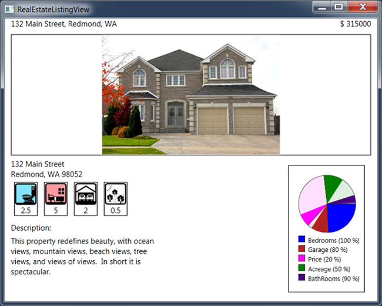
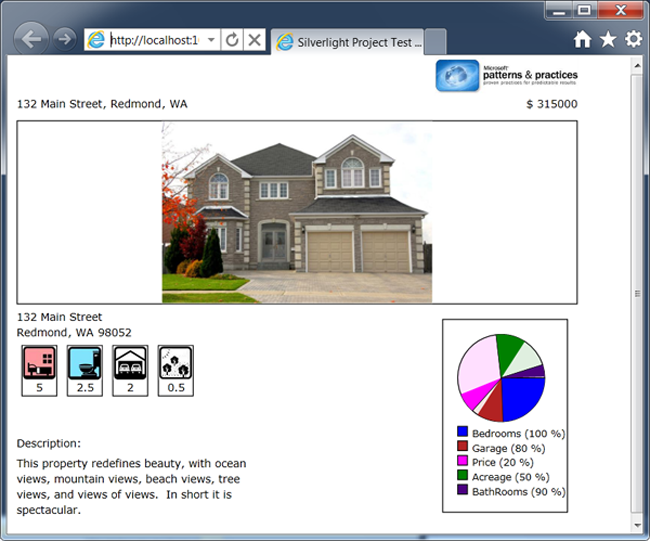
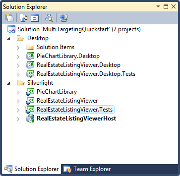
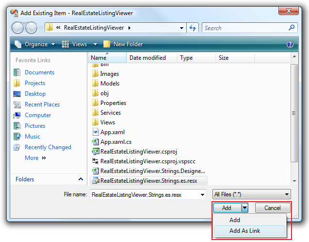
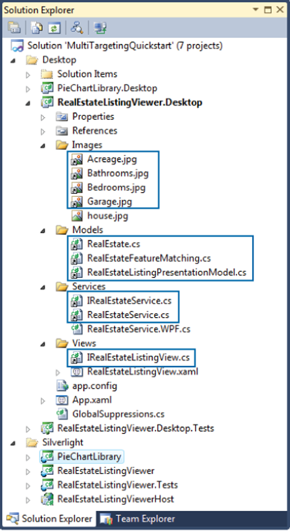

# Multi-Targeting QuickStart

From: [Prism 4.1 - Developer's Guide to Microsoft Prism Library for WPF and Silverlight](/patterns-practices/guide/index)

The Multi-Targeting QuickStart demonstrates the structure of a project created to multi-target Windows Presentation Foundation (WPF) and Silverlight environments through source-code sharing. It provides a WPF desktop experience and a Silverlight Rich Internet Application (RIA) experience.

Although some Silverlight assemblies can be directly used from the .NET Framework 4.0, there are cases in which you need to share source code to create a multi-targeted application. To avoid maintaining two entirely separate code bases, linking the source code from a WPF to Silverlight project is a reasonable solution to these scenarios. This QuickStart demonstrates this linked file approach.

> [!NOTE]
> Manually maintaining the links between files in multiple projects using Visual Studio is possible, but it can be time consuming and error-prone. Because of this, the Prism team created the Project Linker tool. This tool helps to automatically create and maintain links from a source project to a target project to share code that is common to Silverlight and WPF. Therefore, shared code can be written once and built for the target environment. It also works with version control.

You can download [Project Linker](http://visualstudiogallery.msdn.microsoft.com/en-us/5e730577-d11c-4f2e-8e2b-cbb87f76c044) from Visual Studio Gallery or open Visual Studio, click **Extension Manager** on the **Tools** menu, click **Online Gallery** in the **Extension Manager** dialog box, and then search for "Project Linker."

This QuickStart uses Project Linker to link files in WPF and Silverlight projects.

## Business Scenario

The QuickStart is based on a real estate application as shown in the following figure. This window represents the results of a property search. It shows different characteristics of a selected property and includes a pie chart that shows the percentage of how much that property's characteristics match the search criteria.

Multi-Targeting QuickStart – WPF version

## Building and Running the QuickStart

This QuickStart requires Visual Studio 2010 to run. The Silverlight version of this QuickStart also requires [Silverlight 4](http://www.microsoft.com/silverlight/) and the [Silverlight 4 Tools for Visual Studio 2010](http://www.microsoft.com/downloads/en/details.aspx?familyid=b3deb194-ca86-4fb6-a716-b67c2604a139&displaylang=en).

**To build and run the QuickStart**

1. In Visual Studio, open the solution file QuickStart\\MultiTargeting\\MultiTargetingQuickstart.sln.
2. Make sure the desired version of the QuickStart is set as the startup project. If it is not, right-click the desired project in Solution Explorer, and then click **Set as Startup Project**:
   -  To build and run the WPF version of the QuickStart, the startup project should be the **RealEstateListingViewer.Desktop** project in the Desktop solution folder.
   -  To build and run the Silverlight version of the QuickStart, the startup project should be the **RealEstateListingViewerHost** project in the Silverlight solution folder.
3. If you want to build and run the Silverlight version of the QuickStart, right-click the RealEstateListingViewerTestPage.html page, located in the **RealEstateListingViewerHost** project, and then click **Set As Start Page**.
4. On the **Build** menu, click **Rebuild Solution**.
5. Press F5 to run the QuickStart.

## Walkthrough

To explore the scenario, perform the steps to build and run the QuickStart:

1. The main window shows the results of the search, as illustrated in the following figure, which shows the Silverlight version of the QuickStart.

   

   QuickStart main window – Silverlight Version

2. The main window shows a photograph, location, price, characteristics score, and a description of the property.
3. Notice that the pie chart, located in the bottom right corner, represents how closely the characteristics of the current property match the search criteria.

## Implementation Notes

The QuickStart highlights the key implementation details of a multi-targeted application.

## Solution Structure

To follow the shared code/linked projects approach to achieve multi-targeting, structure your solution into two parts: WPF projects and Silverlight projects. To do this, it is recommended that you use Solution folders, as shown in the following figure.

Multi-Targeting QuickStart solution structure

Inside each solution folder, create the corresponding projects. Each project in the solution manages all the references, resources, and code specific to the WPF or Silverlight target environments. The common code that is shared between the two environments is linked from one project (source project) into the other project (target project); consequently, this shared code gets compiled into each target. The reason for using this approach is because WPF and Silverlight are not binary compatible.

To share the code, the common files are added as links in the target projects. To add a link from an existing file to a target project, right-click the target project, point to **Add**, and then click **Existing Item**. After you select the desired file, point to **Add** at the bottom of the dialog, and then click **Add As Link**, as shown in the following figure.

Adding an existing item as a link

## Multi-Targeting QuickStart Solution Elements

The application defined for both environments is structured in several folders for Images, Models, Services, and Views. Note that in the WPF version of the QuickStart, most files in the aforementioned folders are links to the files in the Silverlight version. Silverlight offers a subset of the functionality provided by WPF. Therefore, the same code works with WPF without major modifications, so you should develop your core application in Silverlight.

Solution files can be classified into WPF-specific files or Silverlight-specific files and shared files. Those files that are not specific to WPF or Silverlight are the files that are linked across projects. For many applications, there are very few files that are specific to WPF or Silverlight and, therefore, should not be linked between projects.

### Platform-Specific Files

The following files are platform specific:

-  The application definition file (App.xaml)
-  The **RealEstateListingView** class
-  The **RealEstateService** class

The App.xaml file is the declarative definition of the application. This class is maintained separately in both projects because it is automatically generated and typically does not contain code. Therefore, it is easier to keep the WPF-specific classes and the Silverlight-specific classes than it is to abstract **Application** into a common class.

The **RealEstateListingView** class is the view, a component that is not typically multi-targetable. A main difference between WPF and Silverlight is that in WPF, the user interface (UI) is defined as a **Window**, and in Silverlight, it is defined as a **UserControl**. Notice that in the QuickStart, there are only minor differences in the XAML between the two definitions. Therefore, both views could have been presented as a **UserControl** and shared across WPF and Silverlight. This is a possible approach for simple views; however, more complex applications will probably take advantage of UI features that are specific to WPF and Silverlight, such as 3D or trigger support in WPF or DeepZoom in Silverlight.

The **RealEstateService** service, which implements the **IRealEstateService** interface, is responsible for returning the characteristics of a particular property, including an image of it. The **RealEstateService** class implementation is divided into two partial classes, one of which is the RealEstateService.cs file that is shared between both projects; therefore, this file is defined in the Silverlight project and is linked to the WPF project. This partial class defines the **GetRealEstate** method of the service.

The remaining partial class is environment-specific; consequently, the Silverlight project contains the RealEstateService.Silverlight.cs file, and the WPF project contains the RealEstateService.Wpf.cs file. These files define specific behavior for the WPF or Silverlight environment, so they are not shared between projects. These files define the **GetImage** method. The implementation of this method in WPF differs from the one in Silverlight. In WPF, the property picture is loaded directly from disk, and in Silverlight, the image is downloaded from the web server.

The approach of splitting the implementation of a service over two partial classes (one for Silverlight and one for WPF) can be used to employ different coding strategies in WPF and Silverlight environments. Note that the service interacts with the rest of the core application through a common interface, so this technique is a mechanism to factor implementation level details into files that are only compiled for the intended environment.

> [!NOTE]
> This technique is useful for minor scale implementation differences between WPF and Silverlight. There are some scenarios where the differences between both environments are considerable enough to apply the aforementioned approach. For more information about multi-targeting considerations, see [Multi-Targeted Considerations](/patterns-practices/guide/sharing-code-between-silverlight-and-wpf#MultiTargetedConsiderations)" in [Sharing Code Between Silverlight and WPF](/patterns-practices/guide/sharing-code-between-silverlight-and-wpf).

## Shared Files

Multi-targeted code that is easily shared between both environments is typically the non-UI code. In the WPF version of the QuickStart, most files are linked files because the core application was developed in Silverlight. The QuickStart includes the following shared files:

-  Pictures located in the Image folder
-  Model files, located in the Model folder
-  Services files that have shared implementation, located in the Service folder
-  Interfaces

The shared (linked) files are shown in the following figure.

Linked files shared between Silverlight and WPF projects

> [!NOTE]
> For more information about the elements that can be multi-targeted, see [Multi-Targeted Elements](/patterns-practices/guide/sharing-code-between-silverlight-and-wpf#MultiTargetedElements) in [Sharing Code Between Silverlight and WPF](/patterns-practices/guide/sharing-code-between-silverlight-and-wpf).

## Acceptance Tests

The Multi-Targeting QuickStart includes a separate solution that includes acceptance tests. The acceptance tests describe how the application should perform when you follow a series of steps; you can use the acceptance tests to explore the functional behavior of the application in a variety of scenarios.

**To run the Multi-Targeting QuickStart acceptance tests**

1. In Visual Studio, open the solution file QuickStart\\MultiTargeting\\MultiTargeting.Tests.AcceptanceTest\\ MultiTargeting.Tests.AcceptanceTest.sln.
2. Right-click MultiTargeting.Tests.AcceptanceTest, and then click **Set as StartUp Project**.
3. Press **F5**.

## Outcome

You should see the QuickStart window and the tests automatically interact with the application. At the end of the test pass, you should see that all tests have passed.

## More Information

For more information about the main feature differences between Silverlight and WPF, see [WPF Compatibility](http://msdn.microsoft.com/en-us/library/cc903925(vs.95).aspx) on MSDN.

To learn more about building multi-targeting applications with Prism, see [Sharing Code Between Silverlight and WPF](/patterns-practices/guide/sharing-code-between-silverlight-and-wpf).

You can download [Project Linker](http://visualstudiogallery.msdn.microsoft.com/en-us/5e730577-d11c-4f2e-8e2b-cbb87f76c044) from Visual Studio Gallery or open Visual Studio, click on **Tools**, point to **Extension Manager**, click on **Online Gallery**, and search for "Project Linker."

To learn about other QuickStarts included with Prism, see the following topics in the [Prism4.pdf](http://compositewpf.codeplex.com/releases/view/55580):

-  Modularity QuickStarts for WPF
-  [Modularity QuickStarts for Silverlight](/patterns-practices/guide/modularity-quickstarts-for-silverlight) (also available on MSDN)
-  Basic MVVM QuickStart
-  MVVM QuickStart
-  Commanding QuickStart
-  UI Composition QuickStart
-  State-Based Navigation QuickStart
-  View-Switching Navigation QuickStart
-  Event Aggregation QuickStart

