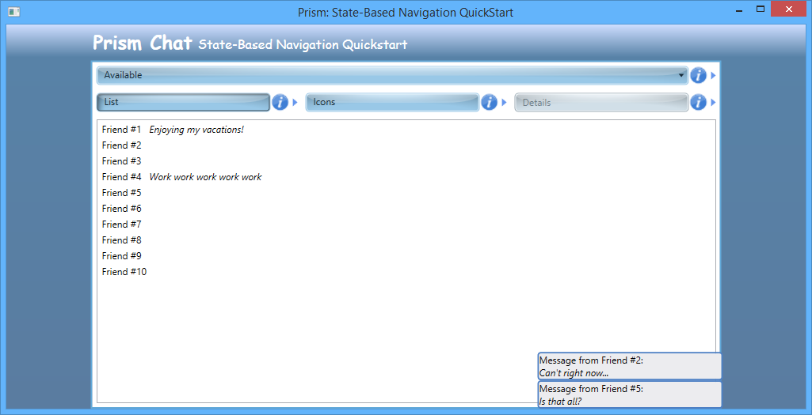
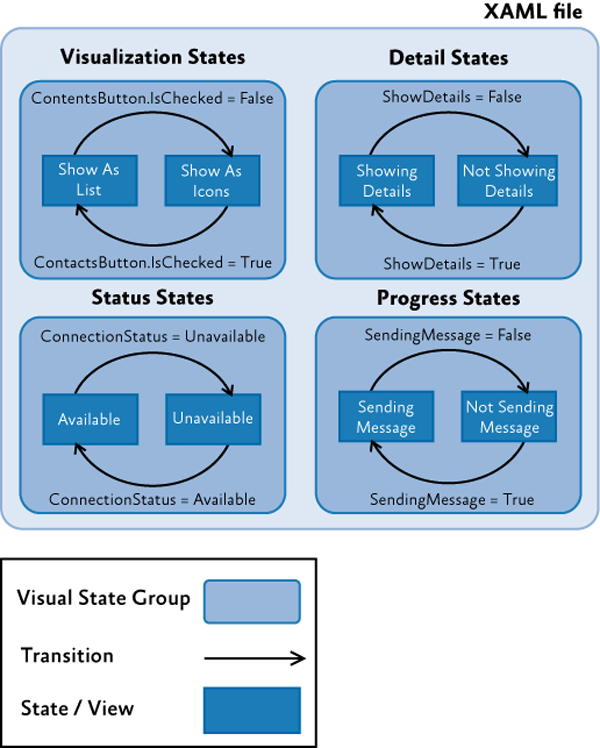
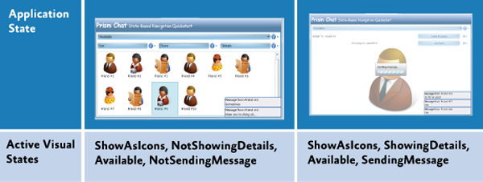

# State-Based Navigation QuickStart Using the Prism Library 5.0 for WPF

From: [Developer's Guide to Microsoft Prism Library 5.0 for WPF](/patterns-practices/index)

The State-Based Navigation QuickStart sample demonstrates navigation using the WPF Visual State Manager (VSM) with the Model-View-ViewModel (MVVM) pattern and the Prism Library. This approach uses the Visual State Manager to define the different application states that the application has, define animations for both the states and the transitions between states; the animations associated to states are active while the state is active for the duration of the specified timeline.

One important aspect of application design is getting the navigation right. To define the navigation of the application, you need to design the screens, interaction, and the visual appearance of the application.

## Business Scenario

The main window of the State-Based Navigation QuickStart represents a subset of a chat application. This window shows the list of contacts of the user. The user can alternate among different views of their contacts: list, icons, or contact detail. The messages from the user's contacts are displayed as they arrive. In the detail view of a contact, you can send a message to that contact. The following illustration shows the QuickStart main window.



State-Based Navigation QuickStart user interface

## Building and Running the QuickStart

The QuickStart ships as source code—this means you must compile it before you run it. This QuickStart requires Microsoft Visual Studio 2012 or later and the .NET Framework 4.5.1.

**To build and run the State-based Navigation QuickStart**

1. In Visual Studio, open the solution file Quickstarts\\State-Based Navigation\_Desktop\\State-Based Navigation.sln.
2. In the **Build** menu, click **Rebuild Solution**.
3. Press F5 to run the QuickStart.

## Implementation Details

The QuickStart highlights the key elements and considerations to implement an approach for navigation that uses the VSM. For more information about the VSM, see [VisualStateManager Class](http://msdn.microsoft.com/en-us/library/system.windows.visualstatemanager.aspx) on MSDN. In this QuickStart, most of the UI is in a few classes (the **ChatView** and **SendMessagePopupView** classes), and the visual states determine what is shown and how to go from one state to another. Some states change visibility of elements within the view, some states change enablement, and some states activate components. This section describes the key artifacts of the QuickStart, which are shown in the following illustration.



State-Based Navigation QuickStart conceptual view

Notice that the Extensible Application Markup Language (XAML) file contains several states (you can compare states to views) grouped in visual state groups. There can be only one active state in each group. Therefore, the state of the application is a combination of four visual states (one of each visual state group). The different transitions are driven by the view. In the preceding illustration, the conditions represented over each transition arrow are the ones that trigger the transition from one state to another. The definition of the animations associated to the transitions and the behaviors that trigger them is also defined in the view's XAML file.

> [!NOTE]
> In the QuickStart, there are only two states per **VisualStateGroup**. This is not mandatory; however, if you have more states, the transition logic could be more complex.

The following illustration shows states of the application and what visual states are active to create them.



Application states and their active visual states

## Logical Views (States)

Typically, the logical views are a form of a UI element that lets users interact with the application. In this application, the logical views are really just states to which the single physical view transitions. A state can involve a single user control or any complex set of user controls. The State-Based Navigation QuickStart has the following states: The list view, the icons view, and the contact view. Additionally, the QuickStart has the send message child view.

Most of these logical view definitions are contained in the Views/ChatViews.xaml file. The following code shows the different logical views within the XAML file.

```XAML
  <ContentControl x:Name="MainPane"
            HorizontalContentAlignment="Stretch" VerticalContentAlignment="Stretch"
            Grid.Row="2">

    <Grid>
        ...
        <!-- Buttons (shared between all views) -->
        <Grid x:Name="ButtonsPanel" Grid.Row="0">
        ...
            <RadioButton x:Name="ShowAsListButton" ... />
            <RadioButton x:Name="ShowAsIconsButton" ... />
            <Button x:Name="ShowDetailsButton" ... />
        </Grid>

        <!-- Contacts view-->
        <ListBox x:Name="Contacts"
                ItemsSource="{Binding ContactsView}"
                Style="{Binding Source={StaticResource ContactsList}}"
                HorizontalAlignment="Stretch" VerticalAlignment="Stretch" Grid.Row="2" Grid.RowSpan="3" Visibility="Collapsed"/>

        <!-- Avatars view-->
        <ListBox x:Name="Avatars"
                ItemsSource="{Binding ContactsView}"
                Style="{Binding Source={StaticResource AvatarsList}}"
                HorizontalAlignment="Stretch" VerticalAlignment="Stretch" Grid.Row="2"  Grid.RowSpan="3" Visibility="Collapsed"
                AutomationProperties.AutomationId="AvatarsView"/>

        <!-- Details view -->
        <Grid x:Name="Details"
                Background="White" Visibility="Collapsed"
                HorizontalAlignment="Stretch" VerticalAlignment="Stretch" Grid.RowSpan="5">
            ...
        </Grid>

    </Grid>
</ContentControl
```

Notice that the views have their **Visibility** property set to **Collapsed**. This means that the controls that compose each view will not be shown and no space will be reserved for them. In this way, navigation between the different views will consist of all views initially collapsed, and navigating into the associated visual state will trigger an animation that will change their visibility to **Visible** (and the animation for the previous state will be stopped, resulting in the visibility for its associated logical view to be reset to the original **Collapsed** value).

## Transitions Between Visual States

Transitions determine how to go from one view to another. The [**DataStateBehavior**](http://msdn.microsoft.com/en-us/library/ff723952(expression.40).aspx) behavior is used to switch between two visual states based on whether a conditional property binding evaluates to **True** or to **False**. With the **DataStateBehavior** behavior, you can compare two values. One value comes from a binding. You can declare the other value to compare to explicitly. If the two values are equal, the visual state specified for **True** is activated. If the two values are not equal, the visual state specified for **False** is activated. The following code shows the behaviors defined in the chat view.

```XAML
  <i:Interaction.Behaviors>
    <ei:DataStateBehavior Binding="{Binding ShowDetails}" 
                Value="True" 
                TrueState="ShowDetails" FalseState="ShowContacts"/>
    <ei:DataStateBehavior Binding="{Binding IsChecked, ElementName=ShowAsListButton}" 
                Value="True" 
                TrueState="ShowAsList" FalseState="ShowAsIcons"/>
    <ei:DataStateBehavior Binding="{Binding ConnectionStatus}" 
                Value="Available" 
                TrueState="Available" FalseState="Unavailable"/>
    <ei:DataStateBehavior Binding="{Binding SendingMessage}" 
                Value="True" 
                TrueState="SendingMessage" FalseState="NotSendingMessage"/>
  </i:Interaction.Behaviors>
```

Notice that depending on the value of the bound property, different states are shown. Apart from the contact list, icons, and details view, there are states for enabling or disabling the application (when the service is not available) and for activating or deactivating the busy indicator (when the application is busy).

Typically, an animation is triggered to make the transition smooth from one state to another. When navigating to a different state, the source view is hidden and the target one is shown. The animation associated to states is permanent. The following code example shows the flipping animation that occurs during a transition. The animation associated to transitions is transient.

```XAML
  <VisualStateGroup x:Name="VisualizationStates">

    <VisualStateGroup.Transitions>

        <VisualTransition From="ShowAsIcons" To="ShowAsList">
            <Storyboard SpeedRatio="2">
                ...
                <DoubleAnimationUsingKeyFrames Storyboard.TargetProperty="Angle" Storyboard.TargetName="rotate">
                     <EasingDoubleKeyFrame KeyTime="0:0:0" Value="360"/>
                     <EasingDoubleKeyFrame KeyTime="0:0:0.5" Value="270"/>
                     <EasingDoubleKeyFrame KeyTime="0:0:0.5" Value="90"/>
                     <EasingDoubleKeyFrame KeyTime="0:0:1" Value="0"/>
                 </DoubleAnimationUsingKeyFrames>

                 <ObjectAnimationUsingKeyFrames Storyboard.TargetProperty="(FrameworkElement.Visibility)" Storyboard.TargetName="Avatars">
                      <DiscreteObjectKeyFrame KeyTime="0:0:0.5" >
                          <DiscreteObjectKeyFrame.Value>
                                 <Visibility>Collapsed</Visibility>
                          </DiscreteObjectKeyFrame.Value>
                                </DiscreteObjectKeyFrame>
                  </ObjectAnimationUsingKeyFrames>

                  <ObjectAnimationUsingKeyFrames Storyboard.TargetProperty="(FrameworkElement.Visibility)" Storyboard.TargetName="Contacts">
                          <DiscreteObjectKeyFrame KeyTime="0:0:0.5">
                                <DiscreteObjectKeyFrame.Value>
                                     <Visibility>Visible</Visibility>
                                </DiscreteObjectKeyFrame.Value>
                                </DiscreteObjectKeyFrame>
                    </ObjectAnimationUsingKeyFrames>

            </Storyboard>
        </VisualTransition>


        <VisualTransition From="ShowAsList" To="ShowAsIcons" ... />

    </VisualStateGroup.Transitions>
    ...
</VisualStateGroup>
```

The states are grouped in different visual state groups. Only one state in a state group can be displayed at a time. For that reason, the **ShowAsList** state (contact list view), and the **ShowAsIcon** state (icons view) are mutually exclusive. The **ShowingDetails** and **NotShowingDetails** states belong to a different group; therefore, the application can be on the **ShowAsIcons** and **ShowingDetails** state at the same time. In this case, the **ShowingDetails** state goes to the foreground and overlaps the icons view; when transitioning to the **NotShowingDetails** states, the details view is collapsed, and the previous view, icons view, is shown. In this way, you do not have to store the previous state for returning because it is active in the background.

## Interaction Requests

Interaction requests provide an abstract approach for view models to request interaction with the user. For more information about interaction requests, see Using Interaction Request Objects in [Advanced MVVM Scenarios](/patterns-practices/guide/6-advanced-mvvm-scenarios-using-the-prism-library-5.0-for-wpf).

The QuickStart uses interaction requests for two different situations: receiving and sending messages:

-  **Receiving messages**. The code in the view models create the objects that support the interactions (by raising an event with a payload to communicate with the view) and expose them through properties so they can be consumed by views. In the following code example from the **ChatViewModel** class, notice that the **ShowReceivedMessageRequest** property is defined and then used on the **OnMessageReceived** event handler to raise the **Message** instance.
	
	```C#	
    public IInteractionRequest ShowReceivedMessageRequest
    {
      get { return this.showReceivedMessageRequest; }
    }

    private void OnMessageReceived(object sender, MessageReceivedEventArgs a)
    {
      this.showReceivedMessageRequest.Raise(a.Message);
    }
	```
  On the view side, it should detect an interaction request and then present an appropriate display for the request. The custom **InteractionRequestTrigger** automatically subscribes to the **Raised** event of the bound **IInteractionRequest**. The following code example, located in the ChatView.xaml file, shows this.
	
	```C#
    <prism:InteractionRequestTrigger SourceObject="{Binding ShowReceivedMessageRequest}">
      <cb:ShowNotificationAction TargetName="NotificationList" />
    </prism:InteractionRequestTrigger>
	```
		
  In the State-Based Navigation QuickStart, the custom **ShowNotificationAction** class is used to temporarily add the received message to a collection and sets this collection as the **DataContext** of a pop-up window. In this manner, the messages will be displayed in a non-modal window for a determined amount of time before disappearing.

-  **Sending messages**. To display the send message window, the **SendMessageRequest** interaction request is used. The **Raise** method of this interaction request is invoked in the **SendMessage** method shown in the following code example from the **ChatViewModel**.
	
	```C#
    public IInteractionRequest SendMessageRequest
    {
      get { return this.sendMessageRequest; }
    }

    public void SendMessage()
    {
      var contact = this.CurrentContact;
      SendMessageViewModel viewModel = new SendMessageViewModel();
      viewModel.Title = "Send message to " + contact.Name;

      this.sendMessageRequest.Raise(
        viewModel,
        sendMessage =>
        {
          if (sendMessage.Confirmed)
          {
            this.SendingMessage = true;

            this.chatService.SendMessage(
              contact,
              sendMessage.Message,
              result =>
              {
                this.SendingMessage = false;
              });
          }
        });
    }
	```
  On the view side, when the interaction request is detected, the **PopupWindowAction** displays the **SendMessagePopView** pop-up window, as shown in the following code example from the ChatView.xaml file.

	```C#
    <prism:InteractionRequestTrigger SourceObject="{Binding SendMessageRequest}">
      <prism:PopupWindowAction IsModal="True"> 
        <prism:PopupWindowAction.WindowContent>
          <vs:SendMessagePopupView />
        </prism: PopupWindowAction.WindowContent>
      </prism:PopupWindowAction>
    </prism:InteractionRequestTrigger>
	```
	
  Note that the **IsModal** property of the **PopupWindowAction** action is set to true to specify that this interaction should be modal. To specify the view that will be displayed when the interaction occurs, use the **WindowContent** property.

## Chat Service

The chat service is used for retrieving the contacts and their data; it is also used for sending and receiving messages from other users. The following code example shows the service interface.
	
```C#
  public interface IChatService
  {
    event EventHandler ConnectionStatusChanged;
    event EventHandler<MessageReceivedEventArgs> MessageReceived;
    bool Connected { get; set; }
    void GetContacts(Action<IOperationResult<IEnumerable<Contact>>> callback);
    void SendMessage(Contact contact, string message, Action<IOperationResult> callback);
  }
```

The service contains the following members:

-  The **Connected** property. This property stores the state of the service: **Connected**/**Disconnected**.
-  The **ConnectionStatusChanged** event handler. This event handler reacts to changes in the connection status.
-  The **MessageReceived** event handler. This event handler reacts when a new message is received.
-  The **GetContacts** method. This method retrieves the contacts of the user.
-  The **SendMessage** method. This method sends messages to the users' contacts.

The service has a timer to simulate incoming messages from other users. On every tick of the timer, there is a 33 percent chance that a message will be received based on a random draw. Additionally, the timer is also used to simulate connection drops; however, the chance of this happening is quite low (1/150). You can see this in the following code example that shows the **OnTimerTick** event handler.

```C#
  private void OnTimerTick(object sender, EventArgs args)
  {
    if (this.Connected)
    {
      var coinToss = this.random.Next(3);
      if (coinToss 0)
      {
        this.ReceiveMessage(
               this.GetRandomMessage(this.random.Next(receivedMessages.Length)),
              this.GetRandomContact(this.random.Next(this.contacts.Count)));
      }
      else
      {
        coinToss = this.random.Next(150);
        if (coinToss 0)
        {
          this.Connected = false;
        }
      }
    }
  }
```

## Custom Behaviors

Behaviors are a self-contained unit of functionality. There are two types of behaviors:

-  Behaviors that do not have the concept of invocation; instead, it acts more like an add-on to an object.
-  Triggers and actions that are closer to the invocation model.

Additional functionality can be easily attached to an object in the XAML or through the designer. They can react to handle an event or a trigger in the UI. The following behaviors are used and defined in the QuickStart (located in the Infrastructure/Behaviors folder):

-  **ShowNotificationAction**. This custom behavior allows a view model to push notifications into a target element in the UI. In the QuickStart, it is used to display the chat messages that are received by the user in the lower-right corner of the UI.

The following behaviors are part of the Prism Library Prism.Interactivity project:

-  **PopupWindowAction**. This concrete implementation displays a specified window or the default one configured with a data template.

## Acceptance Tests

The State-Based Navigation QuickStart includes a separate solution that includes acceptance tests. The acceptance tests describe how the application should perform when you follow a series of steps; you can use the acceptance tests to explore the functional behavior of the application in a variety of scenarios.

**To run the State-Based Navigation QuickStart acceptance tests**

1. In Visual Studio, open the solution file Quickstarts\\State-Based Navigation\_Desktop\\State-Based Navigation.Tests.AcceptanceTest\\State-Based Navigation.Tests.AcceptanceTest.sln.
2. Build the Solution.
3. Open Test Explorer.
4. After building the solution, Visual Studio finds the tests. Click the **Run All** button to run the acceptance tests.

## Outcome

You should see the QuickStart window and the tests automatically interact with the application. At the end of the test run, you should see that all tests have passed.

## More Information

To learn about other navigation topics included with Prism, see the following topics:

-  [Navigation](/patterns-practices/guide/8-navigation-using-the-prism-library-5.0-for-wpf)
-  [View-Switching Navigation QuickStart](/patterns-practices/guide/view-switching-navigation-quickstart-using-the-prism-library-5.0-for-wpf(v=pandp.40))

To learn about other code samples included with Prism, see the following topics:

-  [Stock Trader Reference Implementation](/patterns-practices/guide/stock-trader-reference-implementation-using-the-prism-library-5.0-for-wpf(v=pandp.40))
-  [Modularity QuickStarts](/patterns-practices/guide/modularity-quickstarts-using-the-prism-library-5.0-for-wpf(v=pandp.40))
-  [Interactivity QuickStart](/patterns-practices/guide/interactivity-quickstart-using-the-prism-library-5.0-for-wpf)
-  [MVVM QuickStart](/patterns-practices/guide/mvvm-quickstart-using-the-prism-library-5.0-for-wpf(v=pandp.40))
-  [Commanding QuickStart](/patterns-practices/guide/commanding-quickstart-using-the-prism-library-5.0-for-wpf(v=pandp.40))
-  [UI Composition QuickStart](/patterns-practices/guide/ui-composition-quickstart-using-the-prism-library-5.0-for-wpf(v=pandp.40))
-  [View-Switching Navigation](/patterns-practices/guide/view-switching-navigation-quickstart-using-the-prism-library-5.0-for-wpf(v=pandp.40))
-  [Event Aggregation QuickStart](/patterns-practices/guide/event-aggregation-quickstart-using-the-prism-library-5.0-for-wpf(v=pandp.40))

