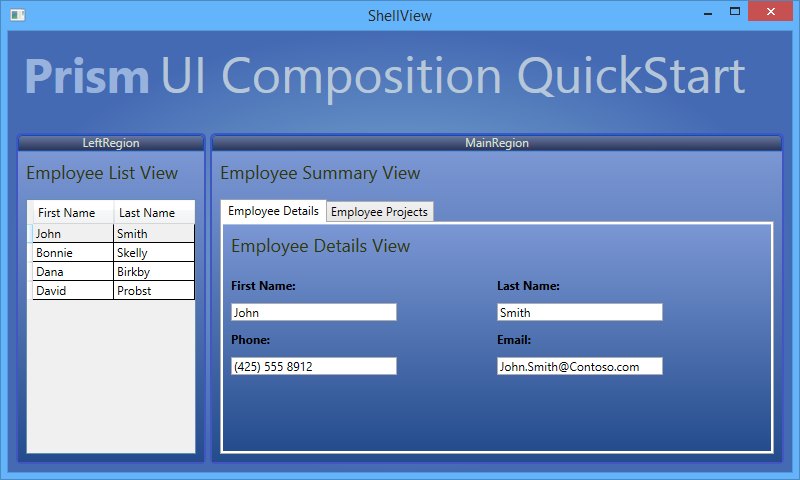
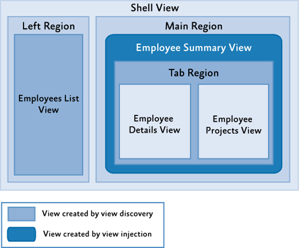

# UI Composition QuickStart Using the Prism Library 5.0 for WPF

From: [Developer's Guide to Microsoft Prism Library 5.0 for WPF](/patterns-practices/index)

The UI Composition QuickStart sample illustrates how to use both the view discovery and view injection approaches for user interface (UI) composition with the Prism Library for WPF. When using view discovery, modules can register views (or presentation models) against a particular named location. When that location is displayed at run time, any views that have been registered for that location will be automatically created and displayed within it. In the view injection approach, views are programmatically added or removed from a named location by the modules that manage them. To enable this, the application contains a registry of named locations in the UI, and a module can look up one of the locations using the registry and then programmatically inject views into it.

## Business Scenario

The UI Composition QuickStart is based on a fictitious resource management system. The main window represents a subset of a larger system. In this window, the user can review detailed information about employees of a company, update their contact information, and view the projects each employee is assigned to. The following illustration shows the QuickStart's main window.



UI Composition QuickStart

## Building and Running the QuickStart

This QuickStart requires Visual Studio 2012 or later and the .NET Framework 4.5.1 to run.

**To build and run the QuickStart**

1.  In Visual Studio, open the solution file QuickStarts\\UIComposition\_Desktop \\UICompositionQuickstart\_Desktop.sln.
2.  In the **Build** menu, click **Rebuild Solution**.
3.  Press F5 to run the QuickStart.

## Implementation Notes

The QuickStart highlights the key implementation details of an application that uses regions, using both the view discovery and view injection approaches to composition. The following illustration shows the key artifacts in the application.



UI Composition QuickStart conceptual view

The following artifacts are illustrated in the preceding figure:

-   **Shell view**. This is the application's main window. This window contains both the left and main regions.
-   **Left region**. This region contains the view that includes the list of employees, through view discovery.
-   **Employees List view**. This view displays a list of employees.
-   **Main region**. This region has the employee summary view injected into it.
-   **Employee Summary view**. This view displays information for an employee and contains a tab region. It is added to the application via view injection.
-   **Tab region**. The tab region resides in the employee summary view, and has the employee details and projects views added via view discovery.
-   **Employee Details view**. This view shows the details about the selected employee.
-   **Employees Projects view**. This view displays the list of projects an employee is working on.

> [!NOTE]
> The QuickStart contains TODO comments to help navigate the important concepts in the code. Use the Task List window in Visual Studio to see a list of these important areas of code. Make sure that **Comments** is selected in the dropdown box of the Task List window. If you double-click an item in the list, the code file will open in the appropriate line.

## Composing the User Interface

The UI Composition QuickStart shows both view discovery and view injection in one application.

The regions are set up in XAML code:

-   The Shell defines the two regions **LeftRegion** and **MainRegion** in ShellView.xaml.
-   The **EmployeeSummaryView** contains a **Tab** control, which defines a region named TabRegion in EmployeeSummaryView.xaml.
-   The **TabRegion** defines a **RegionContext**, which provides a reference to the currently selected employee to all child views, also in EmployeeSummaryView.xaml.

The application determines what views to display in the following manner:

1.  The **OnStartup** method in App.xaml.cs creates and runs the QuickStart's bootstrapper.
2.  In the bootstrapper's **ConfigureModuleCatalog** method, the module catalog is loaded. This module catalog defines a single **EmployeeModule** implemented in the **ModuleInit** class that is loaded by Prism as soon as it is available.
3.  In the **EmployeeModule**, the **ModuleInit** class's **Initialize** method is called by the bootstrapper. This method does a variety of things, including registering an **IEmployeeDataService** (a repository of employee data) and creating an instance of the **MainRegionController**. Using lambda expressions, the **Initialize** method also registers an **EmployeeListView** with the **LeftRegion**, and both an **EmployeeDetailView** and **EmployeeProjectsView** with the **TabRegion** as an example of view discovery. At this point, these regions have not been created.
4.  A bit later in the bootstrapping process, the bootstrapper's **CreateShell** method is called, creating an instance of the **ShellView**, which includes the **LeftRegion** and **MainRegion**.
5.  In the process of creating the **LeftRegion**, Prism determines that a view has been registered with the region and uses the registered lambda expression to create an instance of the **EmployeeListView**. This view is activated and displayed.
6.  Because there are no views registered with the **MainRegion**, nothing is shown here.

When an employee is selected from the **EmployeesListView**, the following occurs:

-   The **MainRegionController**'s **EmployeeSelected** method is called because of an event subscription to the **EmployeeSelectedEvent** through the **EventAggregator**. This event is published by the **SelectedEmployeeChanged** method in the **EmployeeListViewModel** class.

In the **EmployeeSelected** method, the following occurs:

1.  The selected employee is retrieved from the **EmployeeDataService**.
2.  The **MainRegion** is retrieved from the **RegionManager**, and the method attempts to find a view named **EmployeeSummaryView**. Because this view has not been created, it retrieves an instance from the container and explicitly injects the view into the **MainRegion**, showing view injection.
3.  When the **EmployeeSummaryView** is created, the **TabRegion** it contains is also created. This region has a **RegionContext** bound to the **CurrentEmployee** (in EmployeeViewSummary.xaml). When this happens, several other things occur:
    1.  Prism determines that the **TabRegion** has multiple views registered with it, and it creates instances of the **EmployeeDetailsView** and **EmployeeProjectsView** and displays them, showing another example of view discovery. Both of these views subscribe to the **RegionContext**'s **PropertyChanged** event.
    2.  The binding on the **RegionContext** is updated, and the **PropertyChanged** event is triggered.
    3.  Both the **EmployeeDetailsView** and **EmployeeProjectsView** are notified of the **RegionContext** property change and the associated view models are updated, causing the current employee to be displayed.

## Applying View Discovery and View Injection

The view discovery approach allows pulling views inside regions, based on a registry where modules store a collection of pairs (such as views type, region name). This registry is named the **RegionViewRegistry**. When a region is created, it looks for all the view types associated with its region name in the **RegionViewRegistry**. The matching views are created and pulled into the region. When using this approach, the region instance does not have to be found explicitly by name to create the view and inject it into the region.

Typically, views that host other views have context that needs to be available to its child views. For example, if you have a view to select an employee to show its details, dynamically loaded child views probably need to know which employee is currently selected.

The view injection approach allows pushing views into a region that already exists. This requires creating an instance of the view, getting a reference to the region, and associating the two in the **RegionViewRegistry** using the region's **Add** method.

Typically, view injection is used when explicit control of the views in a region is necessary or when the view to display is determined algorithmically.

### View Discovery Approach vs. View Injection Approach

The following are some aspects of the QuickStart that illustrate points to consider when deciding which approach you should use in different situations:

-   The view discovery model does not have timing issues. For example, a module can try to add a view to a region that might not be created yet.
-   It is simpler to show multiple instances of the same region because you do not need to know about scoped region managers to find the specific region instance to inject your views into.
-   You could query the **RegionViewRegistry** class using the **GetContents** method to get all the views associated with a particular region. For example, this list can be bound to a menu.
    In view discovery composition, a region is populated as soon as it gets added to the visual tree, so you have less control over when views are added to a particular region. If you want to load a view at a certain time, it will be difficult to achieve this with view discovery composition.

-   You should not use view discovery composition if you need scoped region managers, such as to have multiple instances of the same view that contains a region at the same time. Because a region gets registered with a region manager, the name has to be unique.

## Registering Views

The **RegionViewRegistry** class in the Prism Library is responsible of registering and retrieving the (region name, view type) pairs. Typically, application modules register their views in their **Initialize** method using a **RegionViewRegistry** instance. The following code example shows the registration of the **EmployeeListView** with the **LeftRegion** in the **Initialize** method of the **ModuleInit** class in the **EmployeeModule** module.

```C#
    this.regionManager.RegisterViewWithRegion( 
          RegionNames.LeftRegion,
          () => this.container.Resolve<EmployeeListView>());
```

The **RegisterViewWithRegion** method of the Prism Library's **RegionViewRegistry** class is used to register the region name with its associated view in the registry. There are two ways to access this method:

-   From the **RegionViewRegistry** directly.
-   From a **RegionManager** instance, because this is an extension method of that class for easy access.
    > [!NOTE]
> This extension method is on the <strong>RegionManager</strong> for easy access, but it does not register the view with that instance of the region manager only. When a region with the specified name is created, regardless of which scoped region manager is registered, the view will be pulled into it.

The **RegisterViewWithRegion** method has two overloads:

-   **RegisterViewWithRegion(string regionName, Type viewType);**
-   **RegisterViewWithRegion(string regionName, Func&lt;object&gt; getContentDelegate);**

If you want to register a view directly, use the first overload. If you want to provide a delegate, such as to resolve the presenter that is responsible for creating the view in a "presenter first" or "ViewModel-first" approach, as seen in the earlier **Initialize** method, use the second overload.

When a region is created, it looks for its associated views in the registry. The matching views are pulled and loaded inside the region. If the first overload is used, a new instance of the view is created using the Service Locator.

## Sharing Context Between Views

The **RegionContext** attached property is useful when you want to share context from a parent view that hosts a region to its child views. This attached property can hold any simple or complex object.

In the UI Composition QuickStart, the **RegionContext** is used to pass the selected employee ID to the ProjectListView view to obtain the projects the selected employee worked on.

The following code, located in the EmployeesSummaryView.xaml file (in the Views directory of the UIComposition.EmployeeModule project), shows how the **RegionContext** attached property is used in XAML.

```XAML
    <TabControl Grid.Row="1"
                AutomationProperties.AutomationId="EmployeeSummaryTabControl"
                Margin="8"
                regions:RegionManager.RegionName="TabRegion"
                regions:RegionManager.RegionContext="{Binding CurrentEmployee}"
                Width="Auto"
                Height="Auto"
                HorizontalAlignment="Stretch"
                ItemContainerStyle="{StaticResource HeaderStyle}">
    </TabControl>
```

To obtain the **RegionContext** in a view, the **GetObservableContext** static method of the **RegionContext** class is used; it passes the view as a parameter and accesses its **Value** property, as shown in the following code example.

```C#
    // EmployeeDetailsView.xaml.cs
    employeeDetailsViewModel.CurrentEmployee = 
         RegionContext.GetObservableContext(this).Value as Employee; 
```

The value of the **RegionContext** can be changed by simply assigning a new value to its **Value** property. You can also subscribe to an event to detect when the **RegionContext** property changes, as shown in the following code example, which subscribes its **PropertyChanged** event to the **RegionContextChanged** event handler.

```C#
    // EmployeeDetailsView.xaml.cs
    RegionContext.GetObservableContext(this).PropertyChanged += (s, e)
            =>
            employeeDetailsViewModel.CurrentEmployee =
            RegionContext.GetObservableContext(this).Value
            as Employee;
```

> [!NOTE]
> The **DataContext** property is not used to share context because the **DataContext** property is typically used for storing the view model of the view.

## Acceptance Tests

The UI Composition QuickStart includes a separate solution that includes acceptance tests. The acceptance tests describe how the application should perform when you follow a series of steps; you can use the acceptance tests to explore the functional behavior of the application in a variety of scenarios.

**To run the UI Composition QuickStart acceptance tests**

1.  In Visual Studio, open the solution file QuickStarts\\UIComposition\_Desktop\\UIComposition.Tests.AcceptanceTest\\UIComposition.Tests.AcceptanceTest.sln.
2.  Build the Solution.
3.  Open **Test Explorer**.
4.  After building the solution, Visual Studio finds the tests. Click the **Run All** button to run the acceptance tests.

## Outcome

You should see the QuickStart window and the tests automatically interact with the application. At the end of the test pass, you should see that all tests have passed.

## More Information

For more information about UI composition, see [Composing the User Interface](/patterns-practices/guide/7-composing-the-user-interface-using-the-prism-library-5.0-for-wpf).

To learn about other code samples included with Prism, see the following topics:

-   [Stock Trader Reference Implementation](/patterns-practices/guide/stock-trader-reference-implementation-using-the-prism-library-5.0-for-wpf)
-   [Modularity QuickStarts](/patterns-practices/guide/modularity-quickstarts-using-the-prism-library-5.0-for-wpf)
-   [Interactivity QuickStart](/patterns-practices/guide/interactivity-quickstart-using-the-prism-library-5.0-for-wpf)
-   [MVVM QuickStart](/patterns-practices/guide/mvvm-quickstart-using-the-prism-library-5.0-for-wpf)
-   [Commanding QuickStart](/patterns-practices/guide/commanding-quickstart-using-the-prism-library-5.0-for-wpf)
-   [State-Based Navigation QuickStart](/patterns-practices/guide/state-based-navigation-quickstart-using-the-prism-library-5.0-for-wpf)
-   [View-Switching Navigation QuickStart](/patterns-practices/guide/view-switching-navigation-quickstart-using-the-prism-library-5.0-for-wpf)
-   [Event Aggregation QuickStart](/patterns-practices/guide/event-aggregation-quickstart-using-the-prism-library-5.0-for-wpf)

Next Topic | Previous Topic | [Home](/patterns-practices/index) | [Community](https://compositewpf.codeplex.com/)